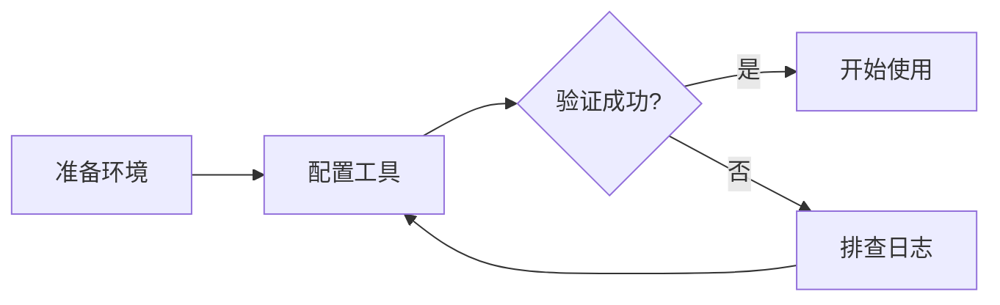

# 本博客的 Firefly 写作指南

核对日期：2026-09-11。用户偏好：以后的文章主动多用 Firefly 提供的功能，让教程更直观、易读、便于操作；按内容选择，不为展示功能而堆砌组件。

## 依据与适用范围

已阅读官方[快速开始](https://docs-firefly.cuteleaf.cn/zh/guide/getting-started.html)、[编写文章](https://docs-firefly.cuteleaf.cn/zh/guide/writing.html)、代码块、Mermaid、PlantUML、文章加密、封面图片、站点配置、沉浸阅读、动态、相册、项目和许可证文档，并核对当前仓库配置、Markdown 插件及已有文章。本文是本地写作约定和语法速查，不是对官方文档的完整转载。

官方文档会先于本仓库更新。使用能力时以 `src/content.config.ts`、`astro.config.mjs`、`src/config/`、`src/plugins/` 为准；升级主题后重新核对下方差异。

## 文章组织与元数据

- 正文放在 `src/content/posts/`，支持 `.md` 和 `.mdx`。一般优先 `.md`；图片多时可用 `主题/index.md` 和同目录资源。
- `pnpm new-post topic/index.md` 可创建文章；脚本默认 `draft: false`，需要草稿时应改为 `true`。不要用 `.md1` 作为新文章格式：内容加载器只收集 `.md` / `.mdx`。
- `title`、`published` 必填；主动补充准确的 `description`、合适的分类和标签。日期使用实际日期，修改旧文章时保留 `published`，按实际变更填写 `updated`。
- `slug` 用稳定的英文短横线形式，发布后不随意修改。它由 Astro 内容加载器处理，即使不在 Zod schema 中也生效。
- `draft: true` 在生产环境过滤；本地开发环境仍会展示，便于预览。
- 作者可沿用已有文章的 `P_star7`；许可证默认继承站点 `CC BY-NC-SA 4.0`。转载按实际情况填写 `author`、`sourceLink` 和许可证，不误标原创。
- 支持 `pinned`、`comment`、`lang`、`licenseName`、`licenseUrl` 等；不无故置顶、关闭评论或更改授权。`prevTitle`、`prevSlug`、`nextTitle`、`nextSlug` 属于内部字段，不手写。

```yaml
---
title: "文章标题"
published: 2026-09-11
description: "用一两句话说明读者能解决什么问题。"
tags: [教程]
category: "教程"
draft: true
slug: topic-guide
author: P_star7
---
```

这是草稿示例，发布状态遵循用户当次要求。封面存在后再添加 `image: ./cover.webp`，不虚构资源路径。

## 优先采用的正文功能

### 提示框：前置条件、技巧与关键提醒

当前主题为 `github`，优先使用以下语法。提示框必须提供有用信息，不要重复紧邻正文。

```markdown
> [!NOTE] 适用范围
> 说明版本、平台和阅读前提。

> [!TIP] 操作技巧
> 给出可选的快捷方法。

> [!IMPORTANT] 必要条件
> 列出继续操作前必须满足的条件。

> [!WARNING] 操作前检查
> 说明真实存在的操作风险和检查办法。

> [!CAUTION] 不可恢复的操作
> 明确说明后果。
```

也支持 `:::tip[自定义标题]` 等容器语法，以独占一行的 `:::` 结束。当前 `enablePythonMarkdownAdmonitions: false`，不要直接使用 `!!!`、`???`、`???+`。

### 代码块：语言、重点、文件名和分平台标签页

代码块必须注明真实语言（如 `powershell`、`bash`、`typescript`、`json`、`yaml`）；普通输出用 `text`。Expressive Code 已集成行号、行标记、折叠功能，可用 `title="文件名"`、`{2}` 等元信息强调关键行，复杂标记需预览确认。

当前超过 15 行的代码默认折叠，预览前 8 行；语言徽章已开启，语言 Logo 关闭。复制按钮自动提供。

多平台命令或等价实现优先用现有 `QQbot.md` 使用的代码分组：

````markdown
::: code-group labels=[Windows PowerShell, macOS / Linux]

```powershell
Get-Location
```

```bash
pwd
```

:::
````

标签数量与代码块数量对应。不能把具有先后依赖的步骤藏进互斥标签页。正文说明关键参数和预期输出，代码内容保持可复制。

### 图表：解释过程、关系与时序

流程和架构优先 Mermaid，使用 `mermaid` 围栏：

````markdown

````

也可按需使用 `sequenceDiagram`、`classDiagram`、`stateDiagram-v2`、`erDiagram`、`gantt`、`pie` 等。当前 `@mermanjs/web` 固定为 `0.8.0-alpha.3`，构建时输出明暗两套静态 SVG；复杂语法兼容性须实际验证。渲染失败可能降级为代码，因此构建成功之外还要检查日志和页面。

PlantUML 已启用，适合 UML 专题，用 `plantuml` 围栏包裹 `@startuml` 至 `@enduml`。当前使用官方公共服务器，图表展示依赖外部服务；不要将私密内容放进发送给公共服务器的图源。

### 图片：截图说明与并排对照

正文图片优先放文章相邻目录并使用相对路径；`public` 资源用 `/` 开头的路径。填写有意义的 alt：本地 `rehype-figure.mjs` 会将其显示为图注。

```markdown


[grid]


[/grid]
```

网格由 `remark-image-grid.js` 提供，适合前后对比和相关截图。手机端会纵向排列；需要看清文字的大截图优先单独显示。图片应当真实存在，截图说明与图中内容一致。

封面支持文章相对路径、`public` 绝对路径和网络 URL。当前详情页封面开启、随机封面关闭，不默认写 `image: api`。

### GitHub 卡片与相关文章

介绍开源工具时，在背景介绍附近使用真实仓库卡片：

```markdown
::github{repo="CuteLeaf/Firefly"}
```

卡片数据依赖 GitHub API；工具名称、用途和重要链接也要在正文写清楚。

当前 Wiki Link 插件支持行内引用、锚点与独立文章卡片：

```markdown
基础操作可参考 [[codex-basic-tutorial|Codex 入门教程]]。

[[codex-basic-tutorial]]
```

独立段落中的无锚点链接会生成文章卡片；`[[文章路径#小节|说明]]` 为普通锚点链接。目标可按自定义 slug、相对 posts 的文件路径或唯一文件名解析，实际 URL 跟随被引用文章的 ID。先确认目标存在、适合公开引用且锚点正确；不引用未完成草稿。`![[...]]` 嵌入语法不受支持。

### 公式、媒体与其他内容

- 数学：行内 `$E=mc^2$`；独立公式用单独行上的 `$$` 包裹。已加载 KaTeX 和 mhchem，化学式可用 `\ce{H2 + O2 -> H2O}` 等语法（化学内容仍须核对配平）。
- 标准 Markdown：按场景使用表格、任务列表、引用、脚注等，复杂排版预览确认。比较参数或方案时优先表格。
- 剧透：`:spoiler[答案或剧情]`；适合解答揭示或剧情内容，不藏必需步骤。
- 视频：支持 HTML iframe 嵌入 YouTube、Bilibili；使用实际视频 ID，填写 title，优先 HTTPS 并关闭自动播放，检查手机端尺寸。
- MDX：仅在确实需要导入组件或表达式时使用。当前集成为 Astro + Svelte + MDX，未配置 React 集成，不能照搬文档中的泛化描述就假定任意 React 组件可运行。

## 按文章类型选择组合

| 内容类型 | 优先考虑 |
| --- | --- |
| 安装与入门教程 | 适用范围提示框、分平台代码组、关键步骤截图、验证方法、排错表 |
| 工具介绍 | GitHub 卡片、实际使用示例、功能对照表、相关文章卡片 |
| 原理或架构解析 | Mermaid 流程/时序图、重点代码、必要公式 |
| 界面改版或体验记录 | 带图注截图、前后图片网格、差异说明 |
| 长篇或多篇连载 | 清晰的二三级标题、前置知识链接、文末关联文章卡片 |

文章标题由页面提供，正文通常从 `##` 开始。让前言清楚说明收益、适用对象和前置条件，方便摘要和读者快速判断；步骤后给出可观察的成功标准。

## 模板的站点功能与当前边界

Firefly 还提供分类/标签/归档、搜索、目录、阅读统计、评论、分享海报、RSS、主题与布局、侧边栏组件、音乐、友链、动态、相册、书签导航、打赏、追番/游戏列表和 Live2D/Spine 等配置。这些多数属于站点能力，不需要在每篇文章重复配置。

当前源码默认开启友链、留言板、动态、书签导航、打赏；相册和 Bilibili/Bangumi/VNDB/MyAnimeList 页面默认关闭。`PUBLIC_PAGES_*` 环境变量可覆盖开关，因此上述是源码默认值，不代表已核实的线上状态。

短消息可用 `src/content/dynamic/*.md`（`published`，可选 `pinned`、`location`）；完整教程仍放 posts。未经内容任务要求，不自动把文章拆成动态或修改站点功能。

已确认的在线文档与本地差异：

- 在线 `series` / `seriesOrder` 文章系列：本地 schema、路由和组件未实现；连载暂用相关 Wiki Link 串联。
- 在线沉浸阅读模式：本地未发现对应配置和实现，不能承诺已有按钮。
- 在线项目内容集合：本地 `src/content.config.ts` 只有 posts、spec、dynamic，不能直接新建 projects 内容期待自动生成页面。
- 在线封面叠加、回退图等配置比本地丰富；新增字段前先核对本地类型。
- Python 风格提示框、随机封面虽然模板提供能力，但当前关闭。

文章密码字段已支持，但只在用户需要时使用。它不隐藏标题、元数据或封面，也不保护仓库中的明文 Markdown 和密码；不应把密码文章当成向公开仓库提交秘密的方式。

## 后续写作检查

1. 先读本指南，再检查相近文章和相关配置；沿用用户当次语气、范围和发布要求。
2. 主动选择能提升理解的组件，确认语法在本地支持；保持已有 slug 和有效链接。
3. 检查元数据、图片、代码、引用目标和外链。区分实测结果与推测，不伪造截图或工具输出。
4. 涉及正文渲染或资源时按仓库要求运行 `pnpm check`、`pnpm type-check`、`pnpm build`；通过 dev/preview 检查图表、代码分组、图片、移动端和明暗主题。
5. 本指南本身位于 docs，不进入文章集合；只更新写作说明时无需重新构建网站。
