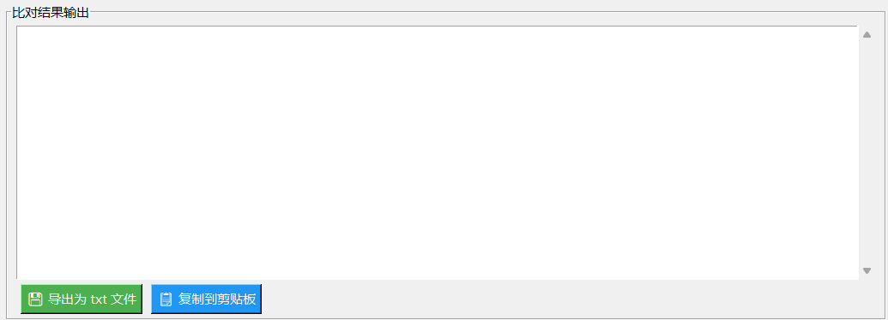

# 🚀 Autotester v1.1——功能更新

## ✨ 新增功能

## # 📊 Tab 1：比对结果导出

- **💾 导出为 txt 文件**：以当前选择的 exe 名称 + 序号命名，保存到当前目录
- **📋 复制到剪贴板**：一键复制全部比对结果，方便发送给他人

### 🖼️ Tab 2：图片压缩工具

- **选择图片来源**：支持本地文件浏览和剪贴板直接粘贴（截图后 Ctrl+V 即可）
- **两种压缩模式**：
  - 按质量压缩（JPEG）：调节 1%-100% 质量
  - 按分辨率缩放：等比例缩小图片尺寸
- **实时预览**：选择图片后显示缩略图预览和原始文件信息
- **自动命名**：压缩后自动生成文件名（原名\_cmp\_模式+比例），输出到 `compressed/` 目录
- **一键打开输出目录**：压缩完成后可直接打开 `compressed/` 文件夹

### 🔐 Tab 3：哈希校验工具

- **文件哈希计算**：选择任意文件，自动计算 MD5 / SHA1 / SHA256 三种哈希值
- **一键复制**：每个哈希值旁有 📋 按钮，点击即复制到剪贴板
- **智能比对**：粘贴课程网站提供的期望哈希值，自动识别类型（32位→MD5, 40位→SHA1, 64位→SHA256），绿字显示匹配结果
- **快捷链接**：内置文档作业网站和编程作业提交网站的直达按钮

---

## 🔨 优化调整

- 自动彩色标记输出内容，方便比对
- 优化窗口显示，更方便使用
- 窗口最小尺寸提升至 `900x1000`
- 优化性能

---