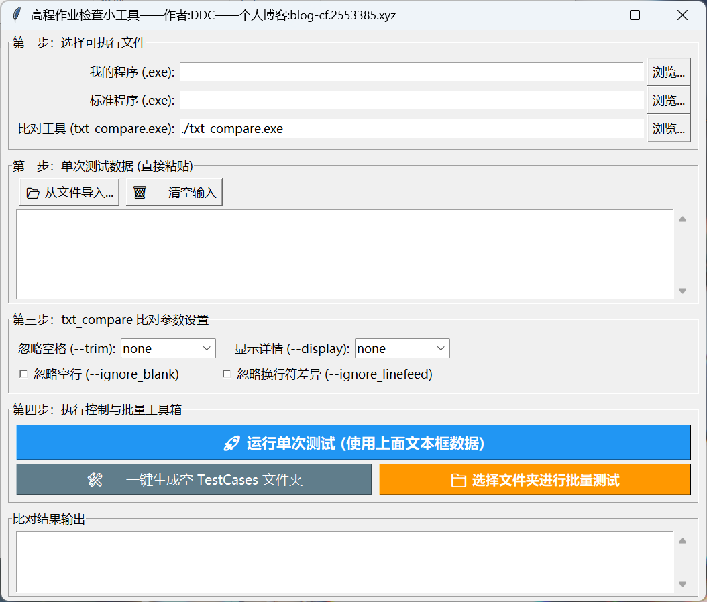
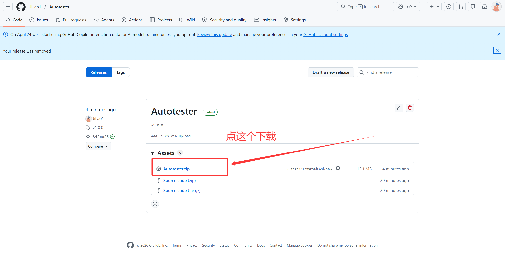
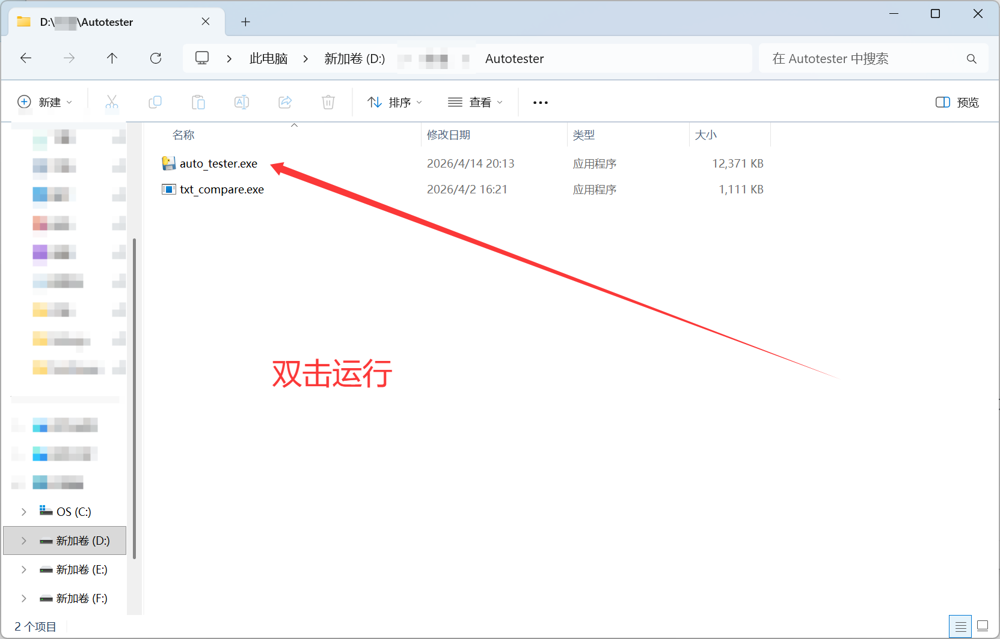
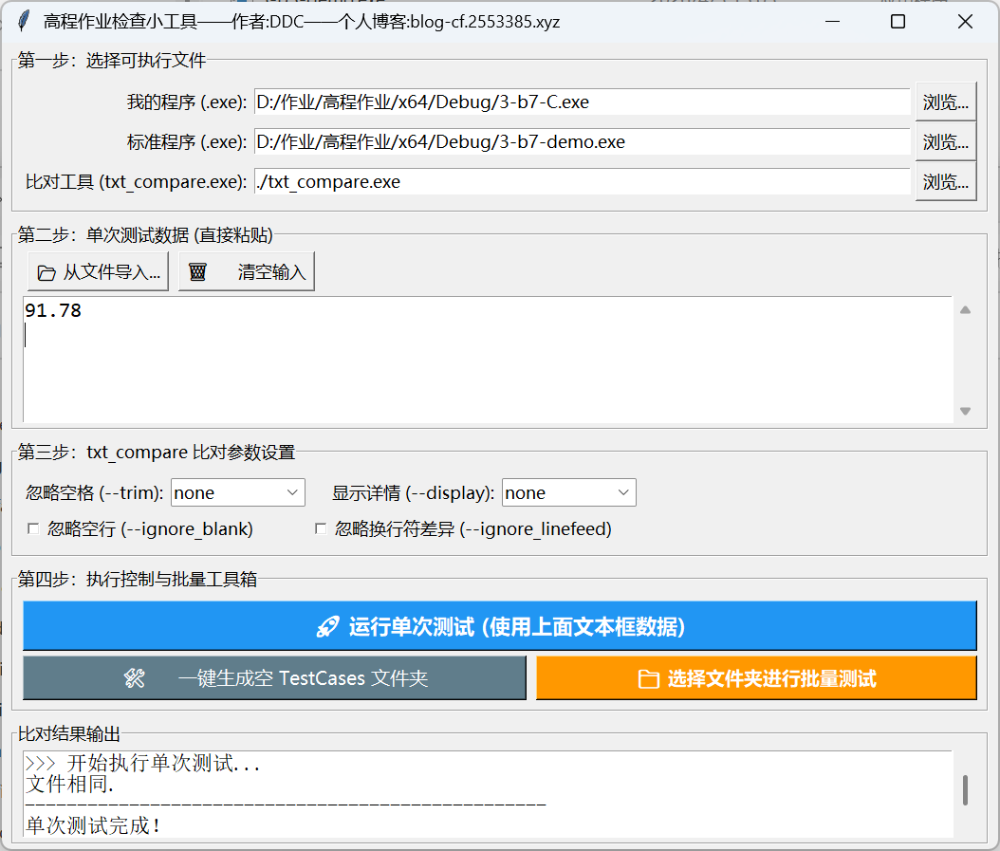

# 🚀 Autotester (高程作业检查小工具)

> 告别繁琐的命令行复制粘贴与批处理，一键完成 C/C++ 作业的自动化测试与结果比对。

## ✨ 特性 / Features

* **🖥️ 可视化界面**：简单易懂的可视化界面，告别cmd。
* **⚡ 单次 & 批量测试**：支持直接在软件内粘贴单组数据测试，支持**一键读取整个文件夹**下的所有测试数据进行自动测试比对。
* **🛡️ 防死循环机制**：内置 1.5 秒强制超时拦截与空文件检测。防止程序死循环导致生成巨大体积文件。
* **🛠️ 批量测试数据生成**：内建辅助工具，一键生成指定数量的空 `.txt` 测试文件并自动唤起文件管理器，提升了录入数据的效率。
* **⚙️ 支持调节参数**：将老师提供的命令行比对工具可视化，支持随时调节 `--trim`、`--ignore_blank` 等所有比对参数。

## 📦 快速开始 / Quick Start

1. 前往 [Releases 页面]([Release Autotester · JiLao1/Autotester](https://github.com/JiLao1/Autotester/releases/tag/v1.0.0)) 下载最新的 `.zip` 压缩包。
   
2. 解压后，双击 `auto_tester.exe` 即可。🎉
   

## 🕹️ 使用指南 / Usage

**第一步：选择文件**
选择你自己编译生成的 `.exe` 程序、标准答案的 `demo.exe` 程序，以及比对工具（默认选择工具相同目录下的txt_compare）。

**第二步：录入测试数据**

* **单次测试**：直接把题目给的样例输入粘贴到中间的文本框里。
* **批量测试**：点击底部的【🛠️ 一键生成空 TestCases 文件夹】，输入需要的数量。在自动弹出的文件夹中，把测试数据分别填入对应的 txt 文件中。(注意：数据输入之后一定要再输入一个回车再保存！否则很可能卡死循环)

**第三步：比对参数设置**
可自行调节txt_compare的内置参数，方便应对不同情况。

**第四步：一键执行**
点击**【运行单次测试】**或**【选择文件夹进行批量测试】**，即可在底部的输出框查看对比结果。

