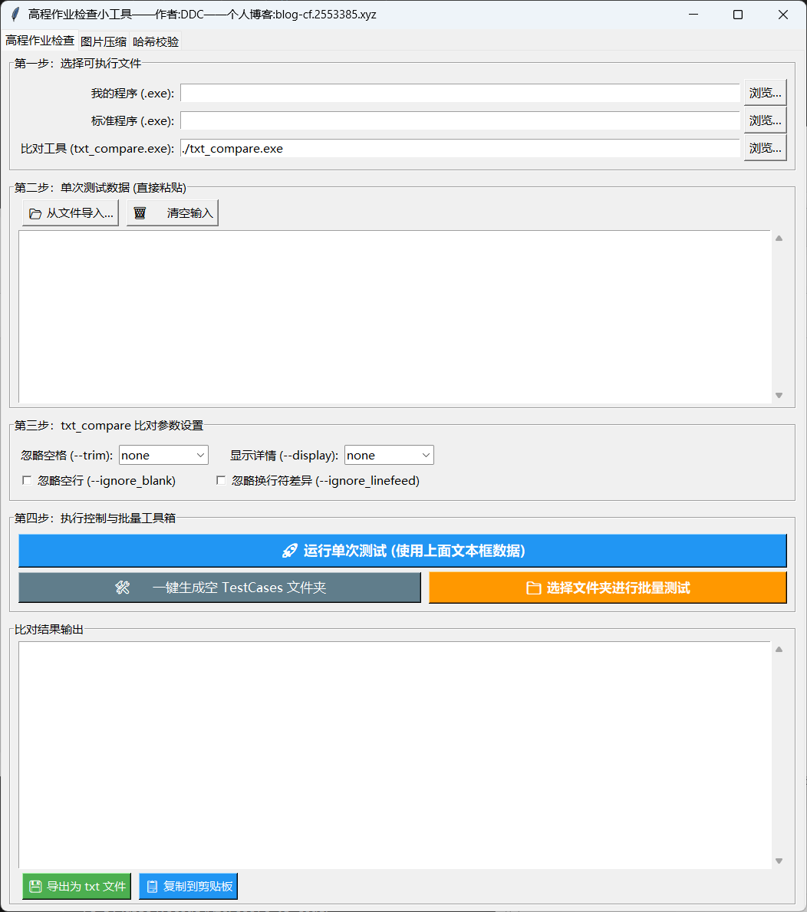
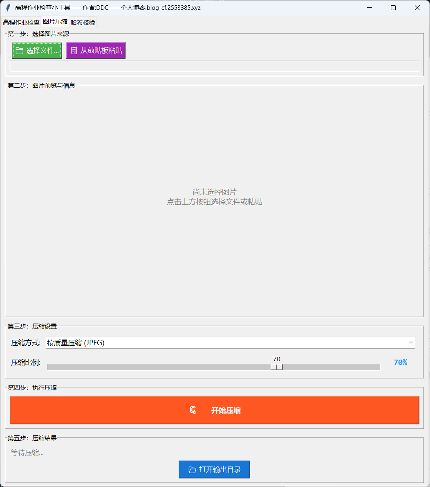
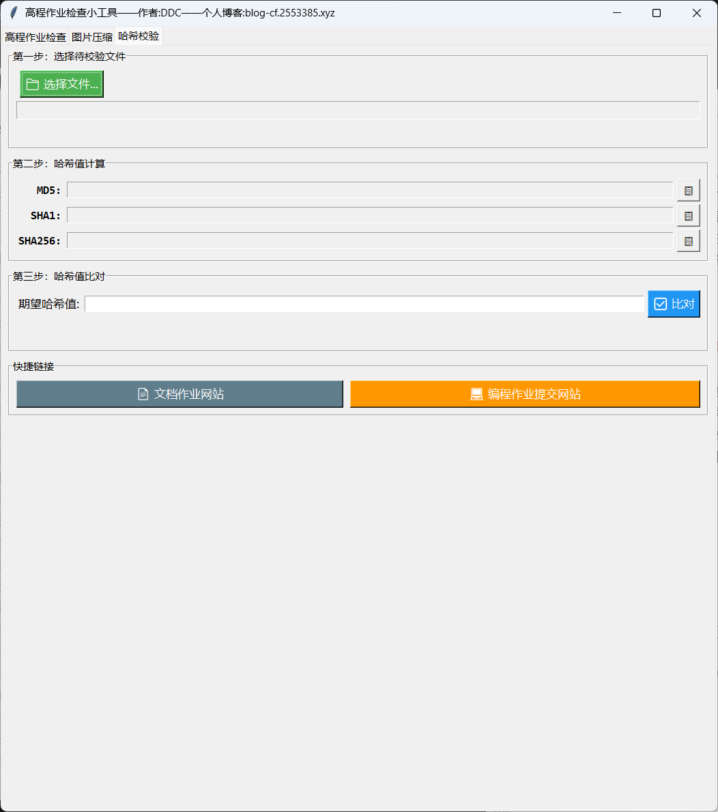

# 🚀 Autotester (高程作业检查小工具)

> 告别繁琐的命令行复制粘贴与批处理，一键完成 C/C++ 作业的自动化测试与结果比对。同时内置图片压缩与哈希校验工具。

## ✨ 特性 / Features

* **🖥️ 可视化界面**：简单易懂的可视化 GUI 界面，告别 cmd。
* **⚡ 单次 & 批量测试**：支持直接在软件内粘贴单组数据测试，支持**一键读取整个文件夹**下的所有测试数据进行自动测试比对。
* **🛡️ 防死循环机制**：内置 1.5 秒强制超时拦截与空文件检测，防止程序死循环导致生成巨大体积文件。
* **🛠️ 批量测试数据生成**：内建辅助工具，一键生成指定数量的空 `.txt` 测试文件并自动唤起文件管理器，提升录入数据的效率。
* **⚙️ 支持调节参数**：将老师提供的命令行比对工具可视化，支持随时调节 `--trim`、`--ignore_blank` 等所有比对参数。
* **🖼️ 图片压缩**：支持从文件或剪贴板导入图片，可按质量（JPEG）或分辨率缩放进行压缩，实时预览与大小对比。
* **🔐 哈希校验**：支持 MD5、SHA1、SHA256 三种哈希值计算与比对，快速验证文件完整性。

## 📦 快速开始 / Quick Start

1. 前往 [Releases 页面]([Release Autotester · JiLao1/Autotester](https://github.com/JiLao1/Autotester/releases/tag/v1.0.0)) 下载最新的 `.zip` 压缩包。
2. 解压后，双击 `auto_tester.exe` 即可。🎉

## 🕹️ 使用指南 / Usage

软件包含三个功能标签页：

---

### 标签一：高程作业检查

**第一步：选择文件**
选择你自己编译生成的 `.exe` 程序、标准答案的 `demo.exe` 程序，以及比对工具（默认选择工具同目录下的 `txt_compare.exe`）。

**第二步：录入测试数据**

* **单次测试**：直接把题目给的样例输入粘贴到中间的文本框里，也可以点击【📂 从文件导入...】从 txt 文件加载数据。
* **批量测试**：点击底部的【🛠️ 一键生成空 TestCases 文件夹】，输入需要的数量。在自动弹出的文件夹中，把测试数据分别填入对应的 txt 文件中。（注意：数据输入之后一定要再输入一个回车再保存！否则很可能卡死循环）

**第三步：比对参数设置**
可自行调节 txt_compare 的内置参数（忽略空格、显示详情、忽略空行、忽略换行符差异），方便应对不同情况。

**第四步：一键执行**
点击【运行单次测试】或【选择文件夹进行批量测试】，即可在底部的输出框查看对比结果。

**结果处理**
* 【💾 导出为 txt 文件】：将比对结果保存为文本文件。
* 【📋 复制到剪贴板】：将比对结果复制到剪贴板，方便粘贴到作业文档中。
* 输出框支持彩色标记：橙色为文件1（你的程序），青色为文件2（标准程序），红色为错误/超时，绿色为通过，蓝色为进度信息。

---

### 标签二：图片压缩

**第一步：选择图片来源**
点击【📁 选择文件...】从本地选择图片（支持 png、jpg、jpeg、webp、bmp、gif），或点击【📋 从剪贴板粘贴】直接粘贴截图。

**第二步：图片预览与信息**
选择图片后将显示预览缩略图，以及原图的文件大小和像素尺寸。

**第三步：压缩设置**
* **压缩方式**：可选"按质量压缩 (JPEG)"或"按分辨率缩放"。
  * 按质量压缩：调节 1%-100% 的 JPEG 质量，数值越小体积越小但画质越低。
  * 按分辨率缩放：调节 1%-100% 的缩放比例，按比例缩小图片宽高。
* **压缩比例**：拖动滑块即可调节，实时显示当前百分比。

**第四步：执行压缩**
点击【🗜️ 开始压缩】，压缩后的文件将自动保存到程序同目录下的 `compressed` 文件夹中。

**第五步：压缩结果**
显示原文件大小、压缩后大小、压缩率，以及输出路径。点击【📂 打开输出目录】可直接打开 `compressed` 文件夹。

---

### 标签三：哈希校验

**第一步：选择待校验文件**
点击【📁 选择文件...】选择任意文件，将显示文件大小。

**第二步：哈希值计算**
选择文件后自动计算三种哈希值：
* MD5（32 位）
* SHA1（40 位）
* SHA256（64 位）

每种哈希值旁都有 📋 按钮，可单独复制到剪贴板。

**第三步：哈希值比对**
在"期望哈希值"输入框中粘贴你期望的哈希值，点击【✅ 比对】按钮。工具会自动根据输入长度识别哈希类型（32 位→MD5, 40 位→SHA1, 64 位→SHA256），并与实际计算的哈希值进行比对，显示匹配或差异结果。

**快捷链接**
底部提供两个快捷按钮：
* 【📄 文档作业网站】：跳转文档作业提交平台
* 【💻 编程作业提交网站】：跳转编程作业提交平台

---
