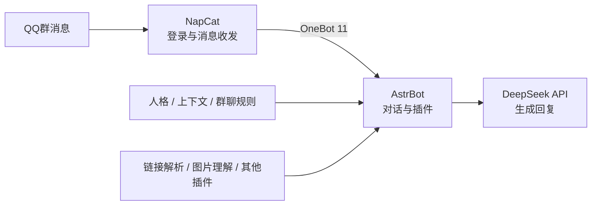

> [!NOTE] 本文目标
> 使用 **AstrBot + NapCat + DeepSeek API + Docker Compose**，在一台 Linux 服务器上搭建可在 QQ 群中聊天的机器人。管理后台仅监听服务器本机，通过 SSH 隧道访问，不直接暴露到公网。

## 方案概览

整个机器人由三部分组成：

1. **NapCat**：登录 QQ，并通过 OneBot 11 收发消息。
2. **AstrBot**：处理消息、管理插件、维护人格和调用大模型。
3. **DeepSeek API**：生成聊天回复。

消息链路如下。



本文不会把管理后台端口开放到公网。浏览器通过 SSH 隧道访问：

```text
本地 127.0.0.1:6099 -> 服务器 127.0.0.1:6099  # NapCat WebUI
本地 127.0.0.1:6185 -> 服务器 127.0.0.1:6185  # AstrBot WebUI
```

### 本文使用的开源项目

::github{repo="AstrBotDevs/AstrBot"}

::github{repo="NapNeko/NapCatQQ"}

## 部署前须知

> [!WARNING] 账号风险
> NapCat 使用非官方方式接入 QQ。使用前应了解相关平台规则和账号风险。建议使用小号

推荐配置：

- Ubuntu 22.04 或更新版本
- 2 核 CPU
- 2 GB 内存，安装较多插件时建议 4 GB
- 20 GB 以上可用磁盘
- 可通过 SSH 登录的普通用户
- 一个 DeepSeek API Key
- Windows、macOS 或 Linux 本地电脑

本文示例中的服务器地址、用户名和路径都是占位符，需要替换为自己的值。

## 一、准备服务器

登录服务器：

```bash
ssh your_user@your_server_ip
```

更新软件包并安装 Docker：

```bash
sudo apt update
sudo apt install -y docker.io docker-compose-v2
sudo systemctl enable --now docker
```

将当前用户加入 `docker` 用户组：

```bash
sudo usermod -aG docker "$USER"
```

退出 SSH 并重新登录，使用户组变更生效。随后检查环境：

```bash
docker --version
docker compose version
```

如果系统只提供旧版 `docker-compose`，可将后文的 `docker compose` 替换为 `docker-compose`。

## 二、创建部署目录

```bash
mkdir -p ~/services/qqbot/napcat/config
mkdir -p ~/services/qqbot/napcat/ntqq
mkdir -p ~/services/qqbot/data
cd ~/services/qqbot
```

目录用途如下：

```text
qqbot/
├── compose.yml
├── data/             # AstrBot 数据和插件
└── napcat/
    ├── config/       # NapCat 配置
    └── ntqq/         # QQ 登录状态
```

`napcat/ntqq` 非常重要。只要该目录持续挂载，重建容器时通常不需要重新扫码登录。

> [!TIP] 记得备份
> 首次成功登录后，建议立即备份 `napcat/config` 和 `napcat/ntqq`。以后更新镜像或调整插件时，只重启真正需要变更的容器。

## 三、编写 Compose 配置

创建 `compose.yml`：

```yaml
services:
  napcat:
    image: mlikiowa/napcat-docker:latest
    container_name: qqbot-napcat
    restart: unless-stopped
    environment:
      NAPCAT_UID: "1000"
      NAPCAT_GID: "1000"
      MODE: astrbot
    ports:
      - "127.0.0.1:6099:6099"
    volumes:
      - ./data:/AstrBot/data
      - ./napcat/config:/app/napcat/config
      - ./napcat/ntqq:/app/.config/QQ
    networks:
      - qqbot

  astrbot:
    image: soulter/astrbot:latest
    container_name: qqbot-astrbot
    restart: unless-stopped
    security_opt:
      - no-new-privileges:true
    environment:
      TZ: Asia/Shanghai
    ports:
      - "127.0.0.1:6185:6185"
    volumes:
      - ./data:/AstrBot/data
      - /etc/localtime:/etc/localtime:ro
    networks:
      - qqbot

networks:
  qqbot:
    name: qqbot
    driver: bridge
```

说明：

- 两个后台端口都绑定到 `127.0.0.1`，公网无法直接访问。
- AstrBot 和 NapCat 位于同一个 Docker 网络，可通过容器名通信。
- 配置、插件和 QQ 登录状态均存放在宿主机，不会随容器删除。
- `restart: unless-stopped` 会在服务器重启后自动恢复服务。

启动服务：

```bash
docker compose up -d
docker compose ps
```

查看启动日志：

```bash
docker logs --tail 100 qqbot-napcat
docker logs --tail 100 qqbot-astrbot
```

## 四、建立 SSH 隧道

由于后台没有暴露到公网，需要在本地电脑建立 SSH 隧道。

> [!IMPORTANT] 为什么不直接开放端口？
> `6099` 和 `6185` 都是管理入口。将它们绑定到 `127.0.0.1`，再通过 SSH 隧道访问，可以减少扫描、撞库和未授权访问风险。

根据本地系统选择对应命令：

::: code-group labels=[Windows PowerShell, macOS / Linux]

```powershell
ssh.exe `
  -i "$HOME\.ssh\server.pem" `
  -N `
  -T `
  -o ExitOnForwardFailure=yes `
  -o ServerAliveInterval=30 `
  -o ServerAliveCountMax=3 `
  -L 6185:127.0.0.1:6185 `
  -L 6099:127.0.0.1:6099 `
  your_user@your_server_ip
```

```bash
ssh \
  -i ~/.ssh/server.pem \
  -N -T \
  -o ExitOnForwardFailure=yes \
  -o ServerAliveInterval=30 \
  -o ServerAliveCountMax=3 \
  -L 6185:127.0.0.1:6185 \
  -L 6099:127.0.0.1:6099 \
  your_user@your_server_ip
```

:::

保持该终端窗口运行，然后访问：

- NapCat WebUI：<http://127.0.0.1:6099/>
- AstrBot WebUI：<http://127.0.0.1:6185/>

如果浏览器无法打开页面，依次检查：

```bash
docker compose ps
ss -lnt | grep -E '6099|6185'
```

然后确认本地 SSH 命令没有退出，也没有出现端口占用错误。

## 五、登录 QQ

打开 NapCat WebUI，按照页面提示登录机器人 QQ。不同版本可能使用扫码登录、快速登录或设备确认。

登录完成后不要删除 `napcat/ntqq`，也不要频繁重建 NapCat 容器。可以通过日志确认状态：

```bash
docker logs -f qqbot-napcat
```

如果页面要求 WebUI 密钥，应从 NapCat 启动日志或服务器上的 NapCat 配置中读取。

> [!CAUTION] 不要泄露登录凭据
> WebUI 密钥、QQ 登录缓存、SSH 私钥和 DeepSeek API Key 都不应进入 Git 仓库。

`MODE: astrbot` 会让 NapCat 按 AstrBot 场景生成 OneBot 配置。进入 AstrBot 后台后，还应在消息平台页面确认对应的 OneBot/aiocqhttp 平台已启用并成功连接。

## 六、接入 DeepSeek API

登录 AstrBot 后台，进入大模型提供商配置，新增一个 OpenAI 兼容提供商。

常用配置如下：

```text
提供商类型：OpenAI Compatible
API Base URL：https://api.deepseek.com/v1
API Key：你的 DeepSeek API Key
模型：deepseek-chat
```

如果需要推理模型，也可以使用 `deepseek-reasoner`，但响应时间和费用通常高于普通聊天模型。群聊机器人优先使用 `deepseek-chat` 会更自然。

保存后，将该提供商设置为默认聊天模型，并在后台测试一次对话。若出现 `401`，通常是 API Key 错误；若出现余额或限流提示，应前往 DeepSeek 控制台检查账户状态。

不要把 API Key 写进公开的 Compose 文件或 Git 仓库。使用后台配置、Docker Secret 或仅服务器可读的环境变量文件保存密钥。

> [!TIP] 模型选择
> 群聊优先使用 `deepseek-chat`。只有确实需要复杂推理时再切换 `deepseek-reasoner`，否则等待时间会明显增加。

## 七、设置机器人人格

在 AstrBot 的人格或系统提示词配置中，可以写入机器人的名字、语气和边界。例如：

```text
你叫小P，是群里的聊天成员。
回复自然、简短，有明确观点，不使用客服式措辞。
不要声称自己执行了没有执行过的操作。
涉及隐私、账号、支付或危险操作时保持谨慎。
避免连续刷屏；没有必要回复时可以不回复。
```

人格提示词不宜过长。先确定名字、语气、回复长度和禁止事项，再通过实际群聊逐步调整。

如果机器人回复过于冷淡，优先修改人格提示词，不要盲目提高温度。过高温度会让回答更随机，也更容易出现事实错误。

## 八、让机器人进入群聊

将机器人账号加入目标群聊，然后在 AstrBot 中检查：

- 平台连接是否正常
- 群聊白名单或黑名单是否包含目标群
- 是否启用了消息过滤或静默规则
- 默认大模型提供商是否可用

建议先使用低风险测试：

```text
@机器人 你好，请用一句话介绍自己
```

确认基本聊天正常后，再逐步开启主动回复、上下文记忆、链接解析、图片理解或群聊学习插件。

## 九、安装插件

AstrBot 插件通常可以从后台插件市场安装，也可以放入数据目录中的插件目录。安装第三方插件前应检查：

- 最近是否仍在维护
- 是否兼容当前 AstrBot 版本
- 是否会读取 Cookie、聊天记录或本地文件
- 是否依赖已失效的第三方解析 API
- 是否会执行浏览器、FFmpeg 或其他高资源任务

插件安装后查看日志：

```bash
docker logs --tail 200 qqbot-astrbot
```

链接解析类插件容易受网站风控影响。网页能在浏览器打开，不代表普通 HTTP 请求也能取得数据。遇到抖音、小红书等平台解析失败时，应先区分以下阶段：

1. 没有识别到链接。
2. 链接识别成功，但网页或接口返回空数据。
3. 媒体解析成功，但图片或视频下载失败。
4. 文件下载成功，但 QQ 发送超时。

这四类问题需要完全不同的修复方法。

<details>
<summary>展开：链接解析问题的快速判断方法</summary>

```text
没有插件日志       -> 正则或事件过滤未命中
有解析日志但无数据 -> 页面风控、接口变更或作品失效
拿到媒体 URL       -> 检查 CDN 下载状态和请求头
文件已下载         -> 检查 OneBot 发送方式、大小和超时
```

</details>

## 十、日常运维

查看状态：

```bash
cd ~/services/qqbot
docker compose ps
```

查看实时日志：

```bash
docker logs -f qqbot-astrbot
docker logs -f qqbot-napcat
```

只重启 AstrBot：

```bash
docker restart qqbot-astrbot
```

只重启 NapCat：

```bash
docker restart qqbot-napcat
```

除非 QQ 连接本身出现问题，否则不要为了重载 AstrBot 插件而重启 NapCat。重启 NapCat 会中断 QQ 会话，并可能触发重新登录或设备验证。

> [!IMPORTANT] 最小化重启范围
> 人格、模型或 AstrBot 插件变更通常只需要重启 `qqbot-astrbot`。只有 QQ 登录或 OneBot 连接本身异常时，才考虑重启 `qqbot-napcat`。

更新镜像前先备份：

```bash
cd ~/services/qqbot
tar -czf "qqbot-backup-$(date +%Y%m%d-%H%M%S).tgz" \
  compose.yml data napcat/config napcat/ntqq
```

然后更新：

```bash
docker compose pull
docker compose up -d
```

生产环境不建议无条件追踪 `latest`。稳定运行后，可以记录当前镜像摘要或固定版本标签，在测试通过后再升级。

## 十一、降低 QQ 掉线概率

频繁掉线通常不只由一个配置引起。以下做法更重要：

- 固定服务器和出口 IP，避免频繁切换地区。
- 持久化 QQ 登录目录，不反复扫码登录。
- 不频繁重启 NapCat 或删除登录缓存。
- 避免同一账号在多个电脑端反复顶号。
- 限制短时间内大量发图、转发、撤回和刷屏。
- 固定可用的 NapCat 与 QQ 版本，不要在无人值守时自动升级。
- 出现掉线时先保存日志，再判断是网络断开、登录态失效还是平台风控。

NapCat 中的 Hook、模块隐藏、容器反检测等开关不是通用的“防掉线按钮”。盲目全部开启可能增加崩溃和兼容性问题，应保持稳定配置，并且一次只调整一个选项。

## 十二、常见问题

<details>
<summary>后台打不开</summary>

确认容器正常、端口只监听本地、SSH 隧道仍在运行：

```bash
docker compose ps
ss -lnt | grep -E '6099|6185'
```

本地端口被占用时，可先关闭旧的 SSH 进程，或把本地端口换成其他值：

```bash
ssh -L 16185:127.0.0.1:6185 -L 16099:127.0.0.1:6099 ...
```

然后访问 `http://127.0.0.1:16185/`。

</details>

<details>
<summary>AstrBot 收不到 QQ 消息</summary>

依次检查：

1. NapCat 是否已经登录。
2. NapCat 的 OneBot 配置是否启用。
3. AstrBot 的消息平台是否启用。
4. 两个容器是否都加入 `qqbot` 网络。
5. 日志中是否出现 WebSocket 连接失败。

</details>

<details>
<summary>能收到消息但不回复</summary>

检查 DeepSeek API Key、模型名称、账户余额、默认提供商和人格配置。还要确认群过滤规则、`@` 回复规则以及其他插件没有提前阻止事件传播。

</details>

<details>
<summary>插件修改后没有生效</summary>

多数情况下只需重启 AstrBot：

```bash
docker restart qqbot-astrbot
```

不要顺手重启 NapCat。

</details>

<details>
<summary>QQ 被踢下线</summary>

立即查看 NapCat 日志并记录准确错误信息：

```bash
docker logs --since 30m qqbot-napcat
```

“被其他设备顶下线”“登录态失效”“设备验证”“网络断开”对应不同原因。不要在没有日志依据时连续扫码和重启，这通常会让问题更难判断。

</details>

## 结语

到这里，一个简单的 QQ 聊天机器人已经部署完成：NapCat 负责 QQ 消息，AstrBot 负责对话和插件，DeepSeek 提供语言模型能力，SSH 隧道负责保护后台。

稳定运行比堆叠功能更重要。先保证登录状态、消息链路、模型调用和数据持久化可靠，再逐步增加链接解析、图片理解、群聊记忆和自动化插件，后续维护会轻松很多。
