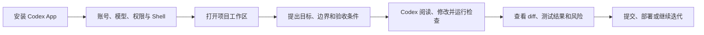

> [!NOTE] 文章说明
> 本文面向第一次接触 Codex 的 Windows 用户，内容覆盖 Codex App、ChatGPT 基本套餐、命令行、Codex++、Skills、插件和 PowerShell 7。价格与软件界面会变化，文中的价格信息截至 2026-08-18，最终以官方页面和软件内显示为准。

Codex 不只是“帮你补几行代码”的聊天机器人。正确使用它的方式，是把它当成一个能读取项目、执行命令、修改文件并汇报结果的开发协作者。

一套完整的 Codex 工作流大致如下：



::github{repo="openai/codex"}

## 一、Codex App 是什么

Codex App 是 OpenAI 面向软件开发工作的桌面客户端。它可以在一个或多个项目工作区中启动任务，让模型读取仓库上下文，修改文件，运行测试、构建和 Git 命令，并在需要时请求权限。

| 普通对话      | Codex 工作区    |
| --------- | ------------ |
| 主要围绕问题和答案 | 围绕真实项目和任务    |
| 需要手动粘贴代码  | 可以直接读取工作区文件  |
| 结果通常是一段建议 | 可以产生实际文件修改   |
| 不负责本地验证   | 可以运行检查、测试和构建 |

> [!WARNING] 先理解权限，再让 Agent 改项目
> Codex 的能力越强，越要注意工作目录、命令权限和敏感文件。第一次使用建议准备一个练习仓库，不要直接把生产项目、私钥和 API Key 放进工作区。

# 第一部分：安装 Codex App

## 二、安装前准备

使用 Codex App 前，需要准备：

- 一个可以登录 ChatGPT 的 OpenAI 账号
- Windows、macOS 或 Linux 桌面环境
- 一个本地项目目录
- Git，建议安装以便查看和恢复修改
- Windows 用户建议安装 PowerShell 7

Windows 上可以先确认 Git 和 PowerShell 版本：

```powershell
git --version
$PSVersionTable.PSVersion
```

## 三、下载并安装 Codex App

建议从 [OpenAI Codex 官方页面](https://openai.com/codex/) 或 ChatGPT 官方入口下载客户端，也可以在微软商店直接下载安装，不要从不明网盘下载修改版安装包。

安装流程通常是：

1. 下载与你的操作系统匹配的 Codex App。
2. 运行安装程序并完成安装。
3. 启动 Codex App。
4. 使用 ChatGPT 账号登录。
5. 根据提示授予应用访问项目目录和执行开发命令的权限。

> [!IMPORTANT] 账号登录与 API Key 不是一回事
> Codex App 的 ChatGPT 登录方式和 API 平台的 API Key 计费方式属于不同入口。使用 ChatGPT 账号登录时，具体可用模型、Codex 额度和并发限制由你的 ChatGPT 计划与当前产品策略决定；不要把 API Key 直接粘贴到普通聊天或项目文件中。

第一次启动后，先打开一个小型项目，发送：

```text
请先介绍当前项目的目录结构、运行方式和主要依赖。
不要修改任何文件，也不要执行删除或联网发布操作。
```

## 四、ChatGPT 基本定价

ChatGPT 套餐价格、名称、地区可用性和 Codex 使用额度可能调整。下表是便于理解的基本分类，不代表所有地区都会显示完全相同的权益。

| 套餐         | 常见价格                               | 适合人群         | 需要注意                       |
| ---------- | ---------------------------------- | ------------ | -------------------------- |
| Free       | 0 美元/月                             | 偶尔体验 ChatGPT | 模型、消息数和 Codex 使用量通常有限      |
| Plus       | 20 美元/月                            | 个人日常使用和开发    | 有更高的模型和 Codex 使用额度，具体受限额影响 |
| Pro        | 200 美元/月                           | 高频开发、重度模型用户  | 价格高，适合确实需要更高额度的人           |
| Business   | 常见为 25 美元/用户/月（年付）或 30 美元/用户/月（月付） | 小团队和组织       | 以结算页面、地区和团队规模为准            |
| Enterprise | 联系销售                               | 企业组织         | 价格、合规、管理和支持能力需要单独咨询        |

购买前请查看 [ChatGPT 官方定价页面](https://openai.com/chatgpt/pricing/)，重点确认 Codex 是否包含、使用额度、模型可用性、并发限制、团队数据策略和地区税费。

> [!TIP] 不要只按消息数量选择套餐
> Codex 的实际消耗还与任务复杂度、上下文长度、模型选择和多轮工具调用有关。建议先使用 Free 或 Plus 实际体验，再决定是否需要 Pro。

### ChatGPT 订阅与 API 计费的区别

| 项目   | ChatGPT 订阅            | OpenAI API    |
| ---- | --------------------- | ------------- |
| 入口   | ChatGPT / Codex App   | API Platform  |
| 计费方式 | 通常按月订阅                | 通常按模型输入输出用量计费 |
| 登录方式 | OpenAI 账号登录           | API Key 或项目凭据 |
| 适合场景 | 人直接使用 Codex 和 ChatGPT | 程序、插件、自动化服务调用 |

Codex++ 还支持自定义 API 提供方，但这不等于 OpenAI 官方套餐。配置第三方 API 前，要确认服务商的隐私、稳定性、计费和合规情况。

# 第二部分：Codex App 基础使用

## 五、打开项目并创建任务

推荐的基本流程是：

1. 打开 Codex App。
2. 添加或选择项目目录。
3. 新建会话。
4. 说明任务目标、限制和验收方式。
5. 让 Codex 先阅读和规划。
6. 审查计划后再允许修改。
7. 查看 diff。
8. 运行测试或构建。

一个合格的任务描述至少包含四部分：

```text
目标：给博客增加一篇 Codex 教程文章。
范围：只修改 src/content/posts，不修改站点配置。
要求：使用现有 Markdown 风格，保留其他文章和隐藏文章。
验收：检查 Frontmatter、链接、代码块和文章路由。
```

与其说“帮我把这个项目做好”，不如把任务拆成多个可以验证的小目标：

```text
第一步只阅读项目并总结结构。
第二步提出实现计划和将要修改的文件。
第三步等我确认后再执行修改。
第四步完成后运行相关检查，并汇报每个文件的变化。
```

## 六、如何阅读 Codex 的结果

每次任务结束后，不要只看它说“完成了”，还要看：

- 修改了哪些文件，是否出现计划外改动。
- 是否执行了测试、构建或格式化。
- 命令退出码是否成功，是否有警告被忽略。
- 是否把密钥、临时文件或生成目录加入了提交。

可以直接要求 Codex 汇报：

```text
请用以下格式总结：
1. 修改了哪些文件以及原因；
2. 运行了哪些命令和结果；
3. 仍然存在的风险；
4. 我下一步应该人工确认什么。
```

## 七、分支、Worktree 与备份

如果任务会修改很多文件，建议先建立 Git 分支：

```powershell
git status
git switch -c codex/feature-name
```

Codex 也可以配合 worktree 把不同任务分隔到不同目录。这样实验性功能不会直接污染主工作区。

> [!CAUTION] 测试通过不代表需求一定正确
> 尤其要检查删除操作、权限逻辑、网络请求、数据库迁移和部署配置。

# 第三部分：Codex 常用指令

Codex App 主要通过界面和会话操作；如果使用 Codex CLI，可以在终端中运行下面这些常见命令。不同版本的命令和参数可能变化，使用前可执行 codex --help 查看当前版本。

## 八、启动与任务命令

```powershell
# 启动交互式 Codex
codex

# 启动时直接给出任务
codex "阅读当前仓库并总结主要模块"

# 查看当前版本和帮助
codex --version
codex --help

# 以一次性任务方式运行
codex exec "运行测试并汇报失败原因"

# 继续已有会话
codex resume
```

不熟悉 CLI 时，优先使用交互模式；自动化脚本或 CI 才适合使用 codex exec，并且要明确设置权限和工作目录。

## 九、交互中的常用斜杠命令

下面是日常最有价值的一组命令，实际名称以当前 Codex 版本的帮助提示为准：

| 命令       | 作用                 |
| -------- | ------------------ |
| /help    | 查看当前版本支持的命令        |
| /status  | 查看会话、模型和工作区状态      |
| /model   | 切换模型或查看模型信息        |
| /diff    | 查看当前会话产生的文件差异      |
| /review  | 请求 Codex 对当前改动进行审查 |
| /plan    | 查看或整理当前任务计划        |
| /compact | 压缩上下文，适合长会话继续工作    |
| /clear   | 清理当前对话上下文          |
| /quit    | 退出当前会话             |

> [!TIP] 先用 /status 再排错
> 当 Codex 行为异常时，先确认当前工作目录、模型、权限模式和会话状态。很多“它没有修改文件”的问题，实际是打开了错误目录，或当前模式不允许执行对应命令。

## 十、常用 PowerShell 辅助命令

```powershell
Get-Location
Get-ChildItem
Get-ChildItem -Recurse -File | Select-String "关键词"
git status
git diff
Get-NetTCPConnection -LocalPort 3000 -ErrorAction SilentlyContinue
```

# 第四部分：Codex++ 安装与使用

## 十一、Codex++ 是什么

Codex++ 是面向 OpenAI Codex / ChatGPT 桌面应用的外部启动器与管理工具。它通过 Chromium DevTools Protocol 和本地辅助服务提供供应商切换、协议转换、会话管理与界面增强，不修改官方应用的 app.asar，也不向安装目录写入补丁文件。

当前仓库最新 Release 为 v1.2.48。Windows 用户下载：

```text
CodexPlusPlus-1.2.48-windows-x64-setup.exe
```

::github{repo="BigPizzaV3/CodexPlusPlus"}

## 十二、安装 Codex++

推荐安装流程：

1. 打开 Codex++ GitHub 仓库的 Releases 页面。
2. 下载 Windows x64 安装程序。
3. 安装完成后，先打开 Codex++ 管理工具。
4. 确认官方 Codex App 的安装路径和运行状态。
5. 配置供应商、模型和增强功能。
6. 最后从 Codex++ 入口启动官方应用。

Codex++ 会创建两个入口：

- **Codex++**：静默启动官方 Codex，并加载保存的供应商与增强配置。
- **Codex++ 管理工具**：管理供应商、模型、插件、会话、脚本、更新和诊断。

> [!WARNING] 不要直接修改 Codex 安装目录
> Codex++ 的设计目标是不向官方安装目录写入补丁。不要自行替换 app.asar 或下载来路不明的修改文件，这会增加更新失败和账号风险。

## 十三、Codex++ 的主要功能

Codex++ 管理工具可以集中管理：

- 官方登录、官方登录混入 API、纯 API 和聚合供应商。
- Responses 与 Chat Completions 协议。
- 模型列表、模型测试、Provider Doctor。
- 每个模型的上下文窗口和自动压缩阈值。
- MCP Server、Skills 与 Plugin。
- 本地会话扫描、批量删除、Markdown 导出和 Token 用量历史。
- 插件市场、模型白名单、Goals、Stepwise 和会话操作。
- 用户脚本、应用检测、Watcher、日志诊断和健康检查。

| 模式         | 适合场景                       |
| ---------- | -------------------------- |
| 官方登录       | 只使用 ChatGPT / Codex 官方账号   |
| 官方登录 + API | 保留官方账号，同时让模型请求走兼容 API      |
| 纯 API      | 完全使用自定义 Base URL 和 API Key |
| 聚合供应商      | 在多个普通 API 提供方之间切换或故障转移     |

> [!IMPORTANT] 先测试，再切换默认供应商
> 在供应商详情中运行模型测试或 Provider Doctor，确认协议、Base URL、API Key 和测试模型匹配。真实 API Key 只保存在本机，请勿放入日志、截图或 issue。

## 十四、Codex++ 的数据位置

根据项目 README，常见数据位置包括：

```text
~/.codex/config.toml
~/.codex/auth.json
~/.codex/sqlite/*.db
~/.codex-session-delete/
~/.codex/backups_state/provider-sync
```

修改供应商配置、认证文件或本地会话前，建议先备份相关目录。

# 第五部分：推荐插件、Skills 与设置

## 十五、先配置项目规则：AGENTS.md

比安装很多插件更重要的，是在项目根目录写清楚项目规则：

```markdown
# 项目协作规则

## 修改范围
- 优先修改 src/，不要直接修改生成的 dist/
- 不要删除用户创建的文章和图片

## 验收要求
- 内容改动后运行 pnpm check
- 代码改动后运行 pnpm type-check
- 构建相关改动后运行 pnpm build

## 风格
- 使用项目已有的组件和工具
- 不提交密钥、缓存和本地日志
- 完成后汇报修改文件、测试结果和剩余风险
```

## 十六、推荐 Skills

| Skill         | 推荐场景                             |
| ------------- | -------------------------------- |
| Playwright    | 浏览器自动化、页面截图和 UI 流程验证             |
| UI/UX Pro Max | 前端布局、色彩、交互和响应式设计                 |
| OpenAI Docs   | Codex、ChatGPT、OpenAI API 和官方文档查询 |
| Cloudflare    | Workers、Pages、DNS 和边缘部署          |
| PDF           | PDF 读取、生成、渲染与版式检查                |
| Documents     | Word 文档生成、修改和渲染                  |
| Spreadsheets  | Excel、CSV 和表格分析                  |

一个 Skill 的关键入口通常是 SKILL.md。安装后，先让 Codex 阅读该 Skill 的使用范围：

```text
请先读取当前可用的 Playwright Skill。
接下来只使用它完成页面截图和移动端布局检查，
不要创建测试文件。
```

> [!TIP] Skill 不是越多越好
> 只安装与你的工作有关的 Skill。Skill 太多会增加选择成本，规则互相重叠时还可能让 Agent 的行为变得不稳定。

## 十七、推荐设置

建议重点确认：

- 默认模型：选择稳定、适合代码任务的模型。
- 权限模式：先使用需要确认的模式。
- 工作区：每个会话打开正确项目。
- Shell：Windows 用户切换到 PowerShell 7。
- 自动压缩：长任务设置合理的上下文压缩阈值。
- 日志与诊断：遇到异常时保留日志，不要公开其中的密钥。
- Git：重要任务使用分支或 worktree。
- MCP、Skills 和 Plugin：按项目需要启用，避免全部打开。

# 第六部分：安装并设置 PowerShell 7

## 十八、安装 PowerShell 7

由于Windows自带的Powershell的雷霆语法，我们经常在使用Codex时遇到GPT大战Powershell的情况。这种情况往往会浪费大量时间与资源，将默认shell修改为Codex更习惯的Powershell7可以省下很多资源。


Windows 电脑可以使用 winget 安装 PowerShell 7：

```powershell
winget install --id Microsoft.PowerShell --source winget
```

安装后打开新的终端窗口，检查：

```powershell
pwsh --version
```

PowerShell 7 的默认可执行文件通常是：

```text
C:\Program Files\PowerShell\7\pwsh.exe
```

## 十九、把 Codex 默认 Shell 改为 PowerShell 7

在 Codex App 的设置中找到终端、Shell 或开发环境相关选项，将默认 Shell 指向：

```text
C:\Program Files\PowerShell\7\pwsh.exe
```

如果 Codex++ 管理工具提供单独的 Shell 或启动环境配置，也要在那里选择同一个 pwsh.exe。保存后完全退出并重新打开应用，再执行：

```powershell
$PSVersionTable.PSVersion
$PSVersionTable.PSEdition
```

不要只修改 Windows Terminal 的默认配置，因为 Windows Terminal、Codex App 和 Codex++ 可能分别保存自己的终端设置。

> [!CAUTION] Shell 改错会导致启动失败
> 如果切换后 Codex 无法执行命令，先恢复为系统默认 Shell，确认 pwsh.exe 路径存在，再重新设置。

# 第七部分：一套高效工作习惯

## 二十、推荐的任务节奏

1. **阅读**：让 Codex 解释仓库结构和当前状态。
2. **计划**：要求它列出修改文件和验收方法。
3. **实施**：只授权必要的工作区和命令。
4. **验证**：运行测试、构建、Lint 或页面检查。
5. **审查**：查看 diff、日志、依赖变化和安全风险。
6. **提交**：由你决定是否提交 Git 或发布。

## 二十一、可复用的高质量提示词

```text
目标：
请完成【具体功能】。

工作范围：
只允许修改【目录或文件】。
不要修改【配置、密钥、生成文件】。

实施方式：
先阅读相关代码并列出计划；
等我确认后再执行修改；
优先使用项目已有的组件、脚本和测试。

验收条件：
完成后运行【命令】；
检查【页面、接口或文件】；
最后汇报修改文件、测试结果和剩余风险。
```

## 最后

Codex 的效率不只来自模型本身，也来自工作区、规则、权限、Shell、Skills 和反馈循环的组合。把任务说清楚，让它先计划再修改；把项目规则写进 AGENTS.md；把 PowerShell 7、Git 分支和必要的 Skills 配置好，使用体验会稳定很多。

Codex++ 适合需要多供应商、模型、插件和会话管理的用户，但它依赖官方 Codex 的页面结构和本地数据格式。使用第三方增强工具前应备份配置，并关注官方应用更新带来的兼容性变化。

> [!NOTE] 参考资料
> 
> - [OpenAI Codex 官方页面](https://openai.com/codex/)
> - [ChatGPT 官方定价页面](https://openai.com/chatgpt/pricing/)
> - [Codex++ GitHub 仓库](https://github.com/BigPizzaV3/CodexPlusPlus)
> - [PowerShell 官方文档](https://learn.microsoft.com/powershell/)
