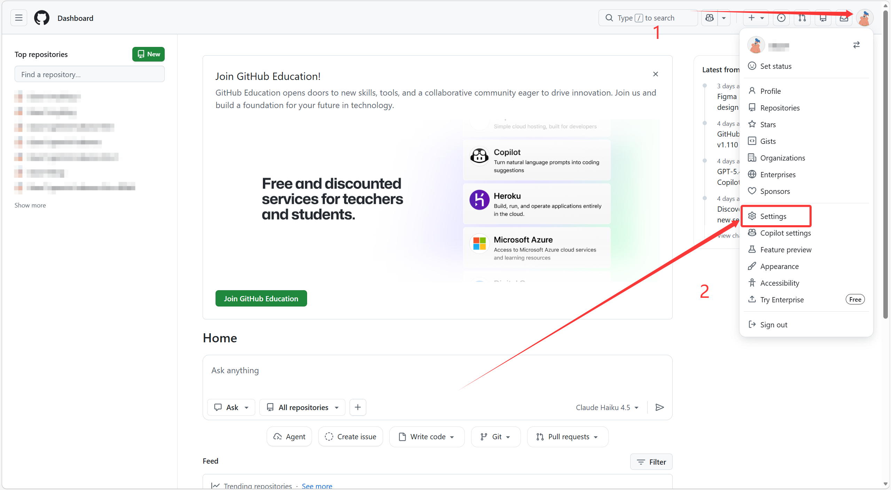
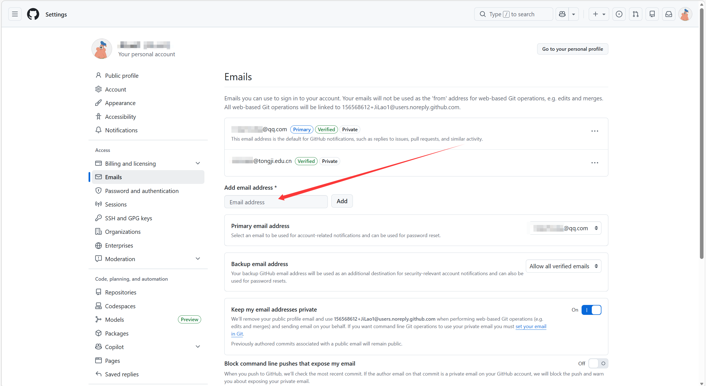
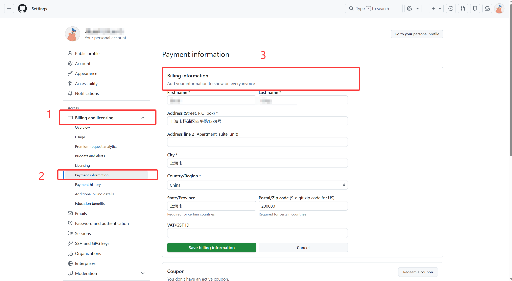
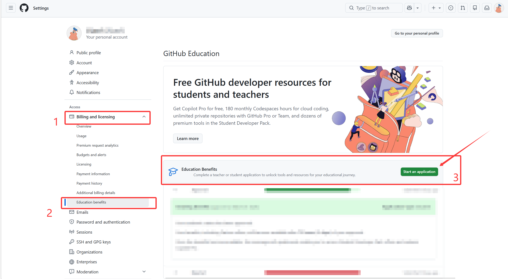
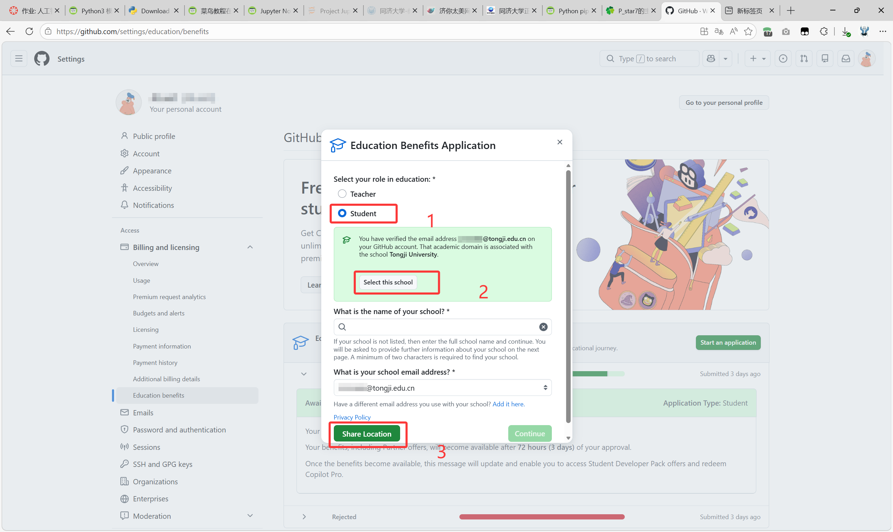
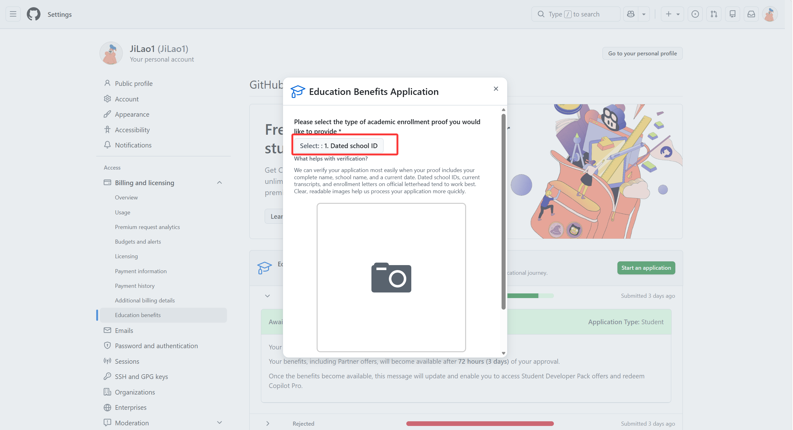
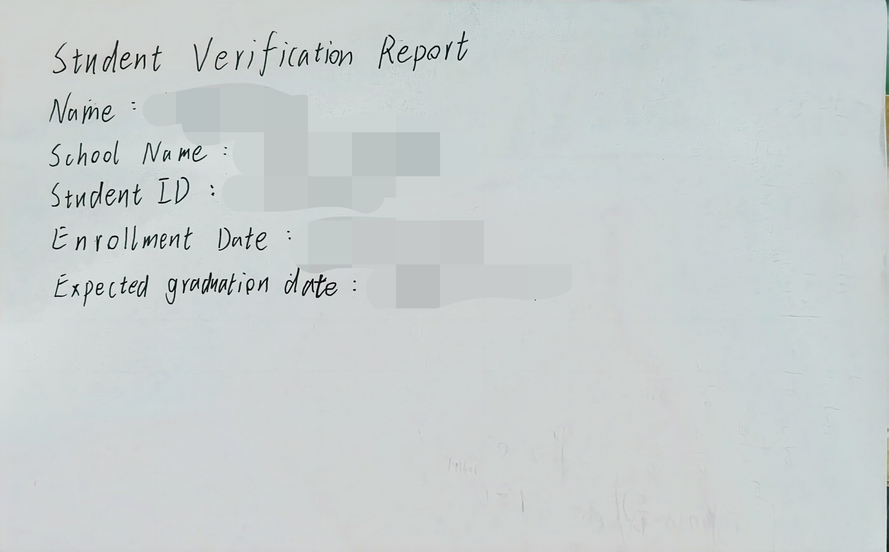
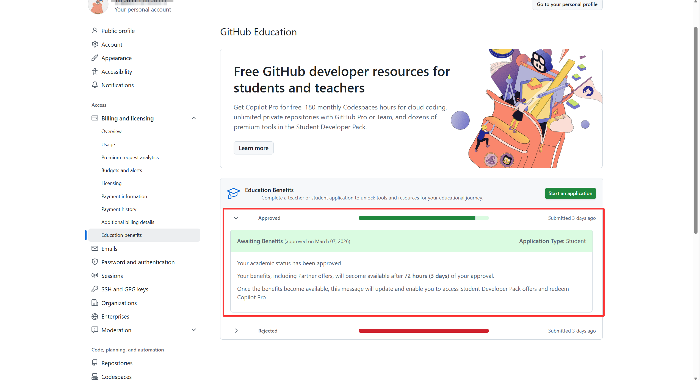

# 如何通过GitHub学生认证并领取2年Copilot Pro

> 本教程将指引你完成Github的学生认证并领取学生福利

---

## 🔑前置准备

* 一个能够访问[www.github.com](https://www.github.com)的网络环境

* 一个学校教育邮箱（@edu.cn后缀）

* 一份学生证明（包含学校信息、入学年份、学生信息的学生证或手写证明）

---

## 💡步骤

### 1.注册并登录Github

此步骤不做详细描述，如果注册时使用的是教育邮箱可以跳过步骤`2.绑定教育邮箱`

### 2.绑定教育邮箱

> 使用教育邮箱注册的账号可以跳过此步骤

* 来到Github，点击右上角头像，点击`Settings`按钮，来到设置界面。

* 在Access下找到`Emails`，在图示位置输入你的教育邮箱并点击`Add`。然后到邮件里完成认证。

> 认证完成后会显示`Verified`

### 3.填写支付信息

* 在`Billing and licensing`下找到`Payment information`，在`Billing information`中填写你的个人信息，最好是真实信息。

* 

### 4.申请学生认证

* 继续在`Billing and licensing`中找到`Payment information`,在右侧点击`Start an application`按钮。

* 在弹窗中依次点击`Student`、`Select this school`、`Share Location`

> 如果你的位置在学校的话这三步可以顺利完成，如果本人不在学校则需在调试中更改位置。

* 在新出现的弹窗中展开`Select`，选择`1.Dated school ID`,在下方点击`Start camera`按钮打开摄像头，上传你的学生凭证。

* 这里推荐使用手写英文版，成功率比较高，参考如下

* 提交完成后稍等几分钟就可以看见是否被接受，接受后等待72小时即认证成功，可以享受学生福利(两年Copilot Pro)

---

## 🎉至此你已完成学生认证全部步骤🎉

