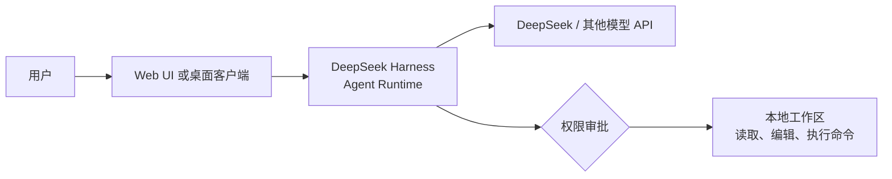
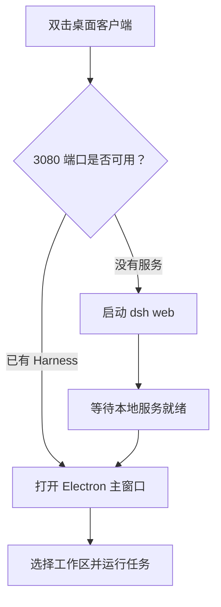

> [!NOTE] 本文内容
> 本文分为两个部分：第一部分按照官方方式部署并使用 DeepSeek Harness；第二部分在此基础上使用 Electron 搭建 Windows 桌面客户端。只想体验 Harness 的读者完成第一部分即可。

DeepSeek Harness（命令名为 `dsh`）是 DeepSeek 开源的智能体框架。它并不是另一个普通聊天客户端，而是一套能够围绕真实工作区读取文件、修改代码、运行命令并维护计划的 Agent 运行环境。

它由 Cordis 驱动，核心设计理念是 **Everything is a Plugin**。模型、工具、技能、会话和界面均可作为插件组合，因此既能直接使用 DeepSeek，也能接入其他模型提供方。

::github{repo="deepseek-ai/deepseek-harness"}



> [!IMPORTANT] Harness 不是本地模型
> Harness 负责界面、任务编排和工具调用，推理仍由模型 API 完成。使用 DeepSeek 官方模型时，需要准备 DeepSeek API Key，并确保账户具有可用额度。

# 第一部分：使用官方方法部署 DeepSeek Harness

官方提供两种运行方式：通过 npm 直接启动，或者克隆仓库后从源码运行。对于大多数用户，推荐先使用 npm 方式；只有准备研究源码、开发插件或参与贡献时，才需要源码部署。

## 一、准备运行环境

首先安装以下工具：

| 工具               | 是否必需     | 用途                       |
| ---------------- | -------- | ------------------------ |
| Node.js          | 必需       | 提供 Node.js 运行时、npm 和 npx |
| Git              | 源码部署必需   | 克隆官方仓库                   |
| pnpm             | 源码部署必需   | 安装和管理项目依赖                |
| DeepSeek API Key | 使用官方模型必需 | 调用 DeepSeek API          |

安装 Node.js 后，打开 PowerShell 或终端检查环境：

```powershell
node --version
npm --version
npx --version
```

只要三个命令都能正常输出版本号，就可以使用官方推荐的 npm 部署方式。

> [!TIP] 建议使用独立工作目录
> `dsh` 会把启动命令时所在的目录作为默认文件系统位置。建议先进入准备交给 Agent 使用的项目目录，再启动服务；即便如此，首次进入 Web UI 后仍需手动添加并选择工作区。

## 二、方法一：通过 npm 直接运行

进入准备使用 Harness 的目录：

```powershell
Set-Location "D:\Projects\your-project"
```

运行官方命令：

```powershell
npx @deepseek-ai/dsh web
```

首次运行时，`npx` 会下载 `@deepseek-ai/dsh` 及其依赖，因此启动时间可能较长。成功后终端会显示：

```text
dsh web: http://127.0.0.1:3080
```

不要关闭这个终端窗口。打开浏览器并访问：

```text
http://127.0.0.1:3080
```

如果希望首次下载时自动确认安装，也可以使用：

```powershell
npx -y @deepseek-ai/dsh web
```

> [!WARNING] 不要直接暴露到公网
> 默认地址 `127.0.0.1` 只允许本机访问。Harness 能够接触工作区文件并运行命令，因此不应为了远程使用而直接把 `3080` 端口映射到公网。

## 三、配置模型

首次进入需要填写API，DeepSeek API Key 可以在 [DeepSeek 开放平台](https://platform.deepseek.com/) 创建。建议为 Harness 单独创建一枚密钥，便于限制、轮换和统计用量。

进入 Web UI 后，也可以打开 **设置 → 模型**。在这里可以管理已填写的API。

> [!IMPORTANT] 保护 API Key
> 官方实现会把凭据存储在 `$DSH_HOME/.credentials.yaml` 中，设置文件只保留凭据引用。不要把该文件提交到 Git，也不要在截图、日志和文章中公开真实密钥。

除了 DeepSeek，模型页面还可以添加 OpenAI、Anthropic 等目录提供方。对于公司网关、自建模型服务或兼容 OpenAI API 的中转服务，可以使用 **添加自定义提供方**。

一个自定义提供方通常需要填写：

- 固定的小写 Provider ID
- API Base URL
- API 协议
- API Key
- 至少一个模型 ID

> [!CAUTION] Provider ID 不宜随意更改
> 已保存会话、默认模型和凭据引用都会使用 Provider ID。需要改名时，最好新建提供方并确认可用，再删除旧配置。

## 四、添加并选择工作区

点击 **选择工作区**，添加希望 Agent 操作的目录，然后选中它。新的 Web UI 默认没有选中工作区，因此在完成这一步之前，会话输入框不可用。

第一次使用时，可以创建一个练习目录：

```powershell
New-Item -ItemType Directory -Path "$HOME\Desktop\dsh-demo"
Set-Location "$HOME\Desktop\dsh-demo"
"# DSH Demo" | Set-Content README.md
```

将 `dsh-demo` 添加为工作区后，新建会话并发送：

```text
请先阅读当前目录，不要立即修改文件。
告诉我项目中有哪些文件、它们分别有什么作用，
然后列出一个三步改进计划，等我确认后再实施。
```

Harness 可以根据任务读取文件、搜索代码、修改内容、执行命令、维护计划，并在当前权限策略要求时向你申请批准。

> [!TIP] 任务描述越清楚，结果越可控
> 最好同时说明目标、允许修改的范围、禁止触碰的文件和完成后需要运行的检查。例如：“只修改 `src/components`，不要改部署配置；完成后运行类型检查和构建。”

## 五、理解权限审批

Harness 能够执行命令，但并不意味着所有操作都应该直接批准。遇到权限确认时，需要检查：

1. 命令是否与当前任务有关。
2. 操作路径是否位于预期工作区。
3. 是否涉及删除、覆盖、上传、安装软件或读取凭据。

> [!WARNING] 重要项目先提交或备份
> 在真实仓库中使用 Agent 前，建议先完成一次 Git 提交。API Key、私钥、Cookie 和生产环境配置也不应放在普通工作区中。

## 六、方法二：从源码运行

如果准备阅读 Harness 源码、开发插件或参与项目贡献，可以克隆官方仓库：

```powershell
git clone https://github.com/deepseek-ai/deepseek-harness.git
Set-Location deepseek-harness
```

安装 pnpm 后，安装依赖并构建：

```powershell
npm install --global pnpm
pnpm install
pnpm run build
```

最后启动 Web UI：

```powershell
pnpm dsh web
```

后续的模型配置、工作区选择和任务使用方式，与 npm 部署完全相同。

| npm 直接运行   | 从源码运行             |
| ---------- | ----------------- |
| 命令少，适合直接体验 | 可以阅读和修改源码         |
| 不需要克隆完整仓库  | 需要 Git、pnpm 和完整构建 |
| 适合普通用户     | 适合插件开发与项目贡献       |

# 第二部分：自行搭建 DeepSeek Harness 桌面客户端

官方 Web UI 已经可以完整使用，但每次都要打开终端、启动服务并访问浏览器。我们可以使用 Electron 做一层桌面封装，让应用自动启动 Harness，再在独立窗口中打开 Web UI。

## 一、桌面客户端的工作原理

桌面客户端并不会重新实现 Harness。它只负责以下流程：

1. 检查本机 `3080` 端口。
2. 如果服务未运行，则执行 `npx -y @deepseek-ai/dsh web`。
3. 等待服务启动完成。
4. 创建 Electron 窗口并加载 `http://127.0.0.1:3080`。
5. 退出客户端时，关闭由客户端启动的 Harness 进程。



## 二、可以让 Agent 帮你搭建

这个桌面壳非常适合交给编程 Agent 完成。你可以使用 Codex、Claude Code、Cursor 等工具，也可以直接使用第一部分刚部署好的 **DeepSeek Harness**。

先创建一个空目录并把它设为 Agent 的工作区：

```powershell
New-Item -ItemType Directory -Path "D:\Projects\dsh-desktop"
Set-Location "D:\Projects\dsh-desktop"
```

然后向 Agent 提交一份边界明确的需求：

```text
请在当前空目录创建一个 Windows Electron 客户端：

1. 启动时检查 127.0.0.1:3080 是否已有服务；
2. 若没有服务，运行 npx -y @deepseek-ai/dsh web；
3. 等待端口可用后创建 BrowserWindow 并加载该地址；
4. 启用单实例锁，外部链接使用系统浏览器打开；
5. 退出时只结束由客户端自己启动的进程；
6. 使用 electron-builder 生成可选择安装目录的 NSIS 安装包；
7. 保持 contextIsolation: true、nodeIntegration: false；
8. 完成后运行一次启动测试，并说明生成安装包的命令。

先列出计划，等我确认后再创建文件。
```

> [!TIP] 为什么仍要理解下面的代码？
> Agent 可以加快搭建速度，但你仍需要知道程序会启动什么命令、访问哪个目录以及何时结束进程。理解关键代码后，才能安全地审核 Agent 的修改。

## 三、创建 Electron 项目

手动搭建时，在空目录中初始化项目：

```powershell
npm init -y
npm install --save-dev electron electron-builder
```

将 `package.json` 调整为：

```json
{
  "name": "dsh-desktop",
  "version": "1.0.0",
  "main": "main.js",
  "scripts": {
    "start": "electron .",
    "dist": "electron-builder --win nsis"
  },
  "devDependencies": {
    "electron": "^33.2.0",
    "electron-builder": "^25.1.8"
  }
}
```

## 四、编写主进程

创建 `main.js`。首先准备端口检测和等待逻辑：

```javascript
const { app, BrowserWindow, shell } = require("electron");
const { spawn } = require("child_process");
const net = require("net");

const HOST = "127.0.0.1";
const PORT = 3080;
const UI_URL = `http://${HOST}:${PORT}`;
let serverProcess = null;
let mainWindow = null;

function portOpen() {
  return new Promise((resolve) => {
    const socket = net.connect(PORT, HOST, () => {
      socket.destroy();
      resolve(true);
    });
    socket.setTimeout(800);
    socket.on("error", () => resolve(false));
    socket.on("timeout", () => {
      socket.destroy();
      resolve(false);
    });
  });
}

async function waitForServer() {
  for (let attempt = 0; attempt < 120; attempt += 1) {
    if (await portOpen()) return true;
    await new Promise((resolve) => setTimeout(resolve, 1000));
  }
  return false;
}
```

然后启动 Harness 服务：

```javascript
async function ensureServer() {
  if (await portOpen()) return true;

  serverProcess = spawn("npx -y @deepseek-ai/dsh web", {
    shell: true,
    windowsHide: true,
    stdio: "ignore",
  });

  serverProcess.on("error", (error) => {
    console.error("Harness 启动失败：", error);
  });

  return waitForServer();
}
```

> [!WARNING] 不要拼接用户输入
> 这里的 `shell: true` 用于让 Windows 正确执行 `npx.cmd`。命令内容必须保持固定，不要把输入框、URL 参数或其他不可信内容拼接进命令字符串。

最后创建窗口并组织应用生命周期：

```javascript
function createWindow() {
  mainWindow = new BrowserWindow({
    width: 1280,
    height: 860,
    minWidth: 900,
    minHeight: 600,
    autoHideMenuBar: true,
    webPreferences: {
      contextIsolation: true,
      nodeIntegration: false,
    },
  });

  mainWindow.webContents.setWindowOpenHandler(({ url }) => {
    if (!url.startsWith(UI_URL)) {
      shell.openExternal(url);
      return { action: "deny" };
    }
    return { action: "allow" };
  });

  mainWindow.loadURL(UI_URL);
}

const hasLock = app.requestSingleInstanceLock();
if (!hasLock) app.quit();

app.whenReady().then(async () => {
  const ready = await ensureServer();
  if (!ready) return app.quit();
  createWindow();
});

app.on("window-all-closed", () => {
  if (process.platform !== "darwin") app.quit();
});

app.on("before-quit", () => {
  if (serverProcess && !serverProcess.killed) serverProcess.kill();
});
```

这是一份最小实现。正式使用时还可以让 Agent 补充加载窗口、日志文件、启动失败提示、第二次启动时聚焦主窗口，以及对 `3080` 端口响应内容的健康检查。

## 五、先在开发模式测试

运行：

```powershell
npm start
```

测试以下场景：

- 未启动 Harness 时，客户端能否自动拉起服务。
- 已手动启动 Harness 时，客户端能否直接复用。
- 外部链接是否在系统浏览器中打开。
- 关闭窗口后，由客户端启动的服务是否结束。
- 重复双击时是否只保留一个实例。

如果一直没有打开窗口，可以先手动运行：

```powershell
npx -y @deepseek-ai/dsh web
```

再检查端口：

```powershell
Get-NetTCPConnection -LocalPort 3080 -ErrorAction SilentlyContinue
```

> [!CAUTION] 端口可用不代表服务正确
> 最小版只检查 `3080` 是否正在监听。如果该端口被其他程序占用，客户端可能打开错误页面。正式版本应增加 HTTP 健康检查，确认返回内容确实来自 Harness。

## 六、打包为 Windows 安装程序

在 `package.json` 中加入 electron-builder 配置：

```json
{
  "build": {
    "appId": "com.example.dsh-desktop",
    "productName": "DeepSeek Harness",
    "directories": { "output": "dist" },
    "files": ["main.js"],
    "win": { "target": ["nsis"] },
    "nsis": {
      "oneClick": false,
      "perMachine": false,
      "allowToChangeInstallationDirectory": true,
      "createDesktopShortcut": true,
      "createStartMenuShortcut": true
    }
  }
}
```

生成安装程序：

```powershell
npm run dist
```

构建完成后，安装包会出现在 `dist` 目录。安装版只包含 Electron 桌面壳，因此目标电脑仍需要安装 Node.js，首次启动也需要联网获取 Harness。

## 七、版本更新与维护

桌面客户端和 Harness 核心是两层独立内容：

| 层级                 | 负责内容                   | 更新方式        |
| ------------------ | ---------------------- | ----------- |
| Electron 客户端       | 窗口、启动流程、日志和安装包         | 修改源码后重新打包   |
| `@deepseek-ai/dsh` | Web UI、模型、工具和 Agent 行为 | 由 npm 包版本决定 |

本文示例运行的是：

```powershell
npx -y @deepseek-ai/dsh web
```

命令没有固定版本，因此未来 npm 包更新后，界面和配置可能发生变化。Harness 目前仍处于开发者预览阶段，官方明确提示可能出现破坏兼容性的变更。

如果更重视稳定性，可以把客户端中的命令固定到经过验证的版本，例如：

```powershell
npx -y @deepseek-ai/dsh@0.1.0-rc.6 web
```

确认新版本可用后，再修改版本号并重新打包。

## 最后

官方部署方式已经足够完成完整的 Agent 工作流；桌面客户端的价值，是把“启动本地服务并打开网页”整理成一次双击操作。

搭建客户端时不必独自从零编写所有代码。你可以让任意擅长编程的 Agent 参与，也可以直接让刚部署好的 DeepSeek Harness 在一个空工作区中搭建自己的桌面外壳。关键是先写清需求和安全边界，再审查它创建的命令、依赖和进程管理逻辑。

在这里也分享一份我自己打包好的桌面客户端，可以直接一键安装。(安装前请自行安装好Node.js)

[https://wwbdl.lanzouw.com/iLu3x42s7cyd](https://wwbdl.lanzouw.com/iLu3x42s7cyd)
密码  b3ba

> [!NOTE] 参考资料
> 本文依据 DeepSeek Harness 官方仓库、官方 Web UI 用户指南和模型配置说明整理。项目处于快速迭代阶段，实际界面和命令应以官方仓库最新说明为准。
