# 如何注册dpdns.org永久免费域名，并一键托管到Cloudflare

> 本教程将介绍如何注册账号并免费领取dpdns.org域名。

## 使用流程

### 1.账号注册

*打开Digitalplat官网[domain.digitalplat.org](domain.digitalplat.org)

*点击`register a domain`按钮，来到登陆界面。

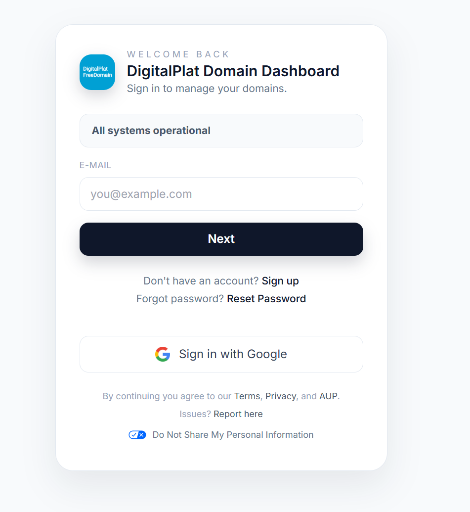

*可以自己注册，也可以用google登录。*

*点击`Sign up`按钮，进入注册界面。

*此处的信息用随机信息生成网站生成一个即可，网站链接：[https://www.fakepersongenerator.com/](https://www.fakepersongenerator.com/)

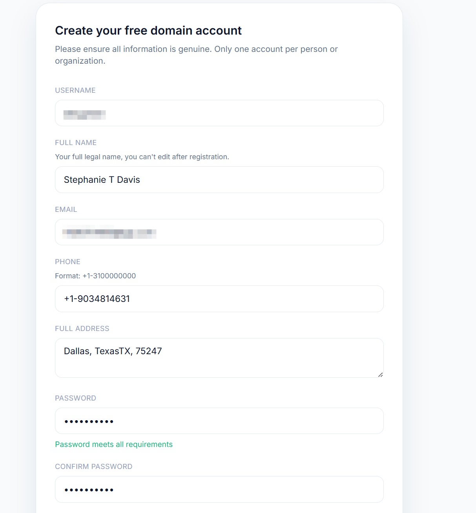

*用户名随便填，邮箱需要填一个能接收邮件的，这里我用我自己的。其余信息用工具提供的随即信息即可，注意要符合要求的格式。

*（比如电话号要写成+1-0000000的形式，地址里面不能出现括号或者中文标点符号）*

*填写完毕设置好密码，点击`Register`按钮。

*注册成功后前往你刚才填写的邮箱，点击验证链接。

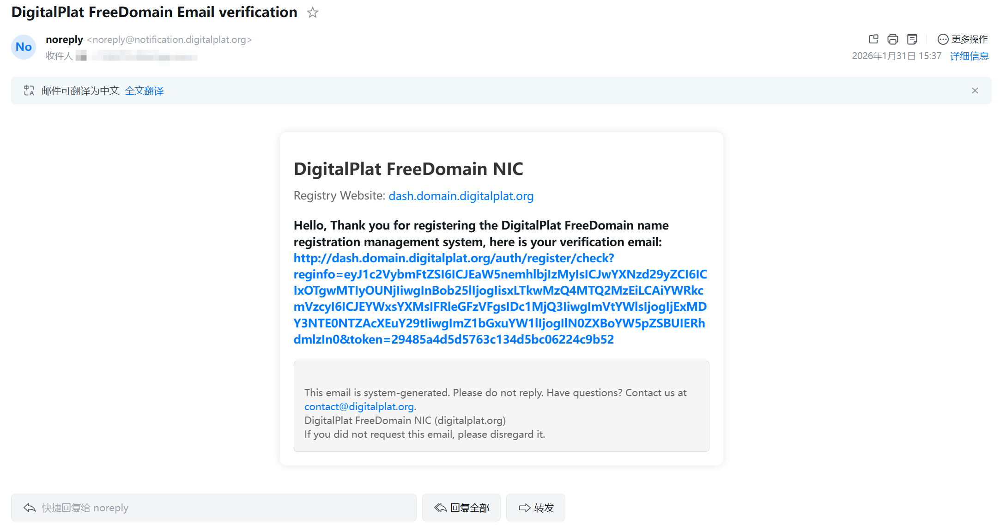

*验证成功后回到官网，再次点击`register a domain`按钮，用刚才使用的邮箱登录。

*这里会提示验证KYC，直接用github验证即可。

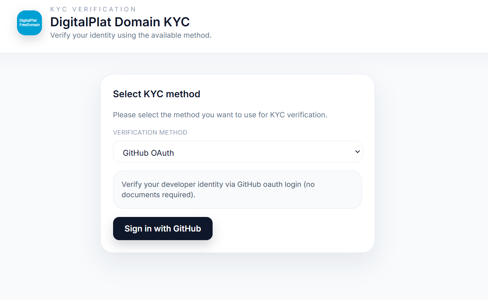

*验证完成后账号即注册完成。

### 2.域名注册

*来到仪表盘，点击左边`Domain Registration`按钮。

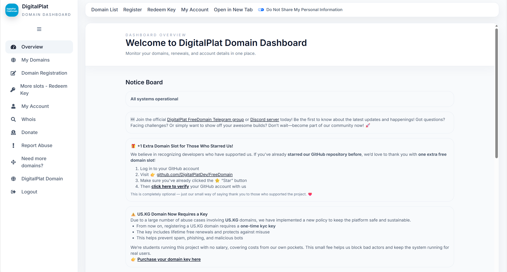

*在下方输入你的域名名字，后缀选.dpdns.org即可，记得勾选服务条款。

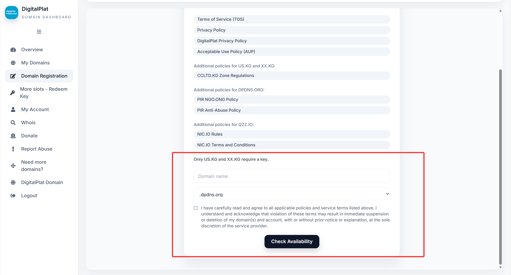

### 3.DNS解析

*注册成功后，需要解析DNS。这里使用Cloudflare，前往cloudflare官网并登陆自己的账号：[www.cloudflare.com](https://www.cloudflare.com/)

*在左侧点击`Domain`，添加一个新的域名，将自己注册到的域名填写进去,其余选项不变即可。

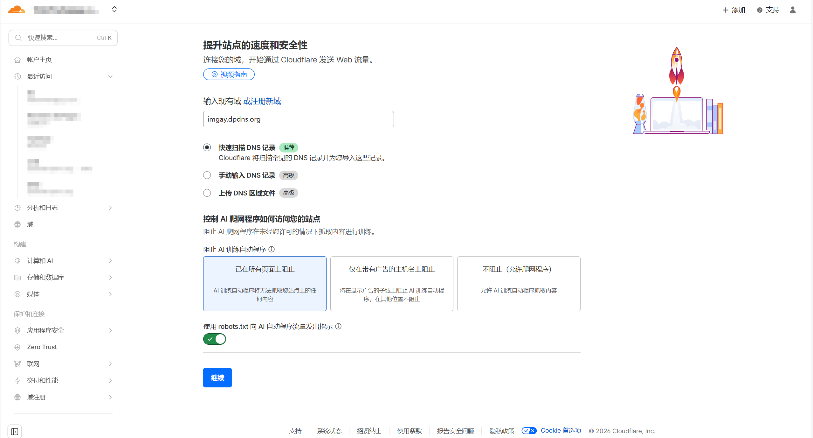

*选择计划直接选择免费的即可。

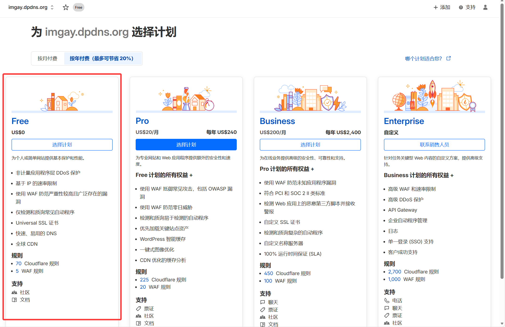

*若出现让你手动输入，直接点击`继续前往激活`

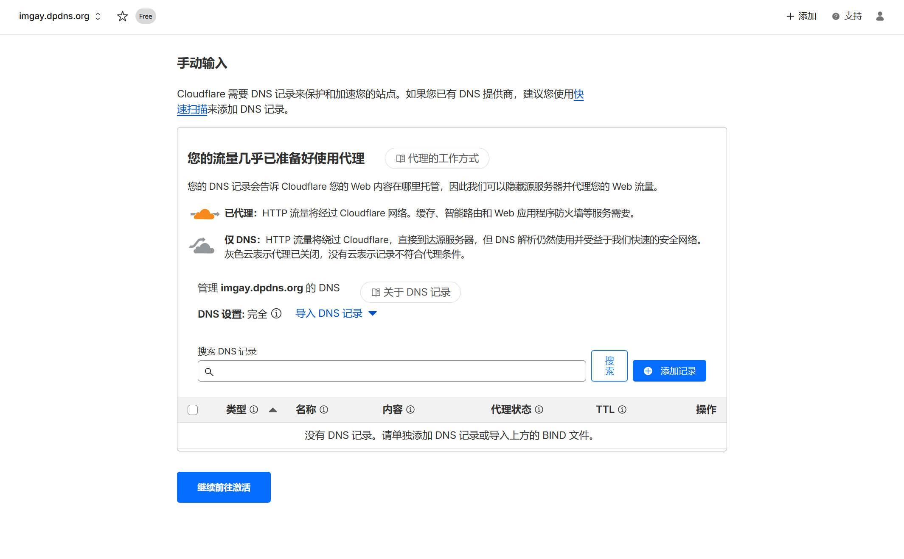

*这里会提示让你替换名称服务器，按照要求替换即可。

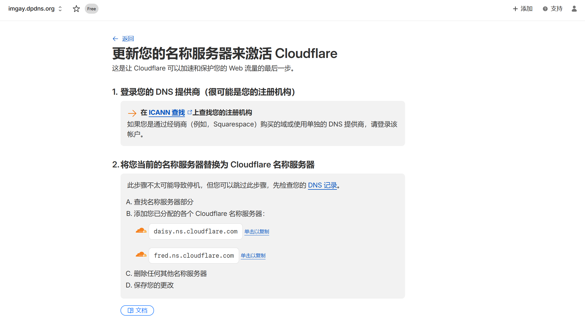

*复制这里的名称服务器，回到刚才的域名网站，粘贴进1、2名称服务器中，如图。

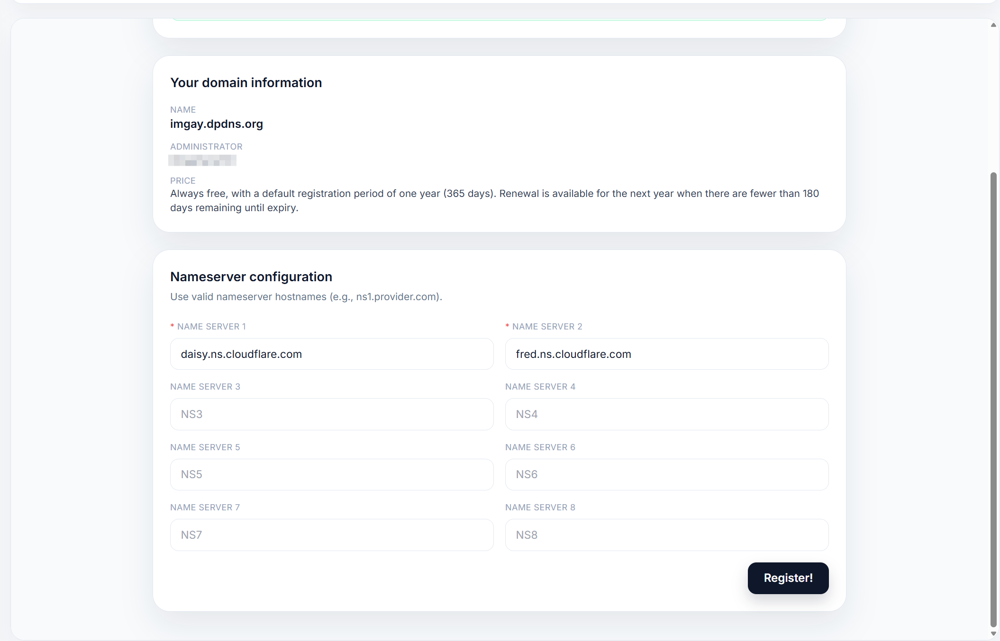

*完成后点击`Register`按钮，之后等待cloudflare解析完成，时间不定，解析完成一般会给你发送邮件。

*解析完成后域名即可使用。

### 4.定期更新

本网站注册的域名虽然免费，但180天不更新会被收回。我们只需要180天后更新域名即可。

*来到DigitalPlat,点击左侧My Domains,点击你之前注册的域名，点击`Renew`,点击`Request free renewal`，按要求更新即可。

