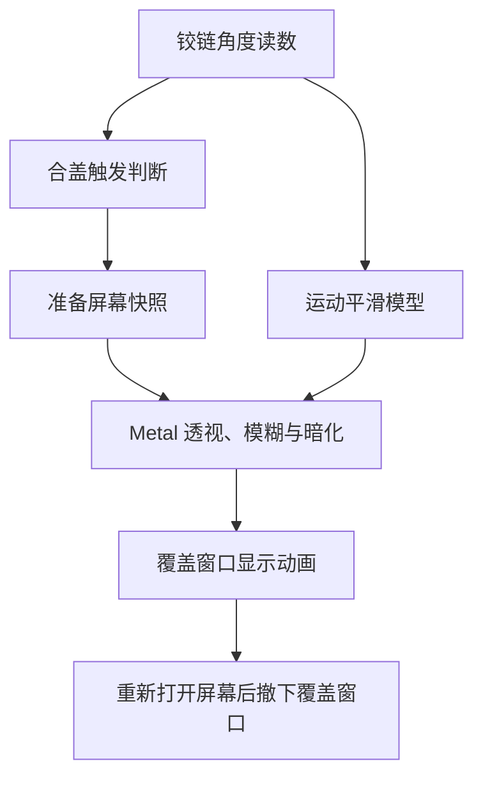

import { Steps, StepItem } from "@components/firefly-mdx";

一个神秘的小项目（虽然早就有人做过了）：**MacBook Duo Fold**。它给 MacBook 加了一段跟随合盖动作的视觉效果——屏幕里的画面先定格，再随着屏幕倾斜产生透视变化，逐渐变得模糊、暗淡，最后消失。


项目地址：[JiLao1/MacBookDuoFold](https://github.com/JiLao1/MacBookDuoFold)。

::github{repo="JiLao1/MacBookDuoFold"}

## 它看起来是什么效果？

可以想象桌面画面留在原来的位置，而 MacBook 屏幕变成了一块正在向前倾斜的玻璃：从这块玻璃里看到的画面会偏移、模糊，并且越来越暗。

动画由屏幕开合角度驱动。缓慢合盖时，效果跟着变化；重新打开屏幕后，覆盖画面会撤下，回到正常桌面。应用常驻菜单栏，也提供**手动预览**，不用反复合盖就能看看效果。

> [!NOTE] 这是桌面视觉效果
> 应用不会把 MacBook 变成真正的折叠屏（我去不早说），也不会改变系统的合盖休眠逻辑。动画使用屏幕快照，因此播放中的视频、时钟等内容会在效果期间定格。

## 主要功能

| 功能 | 可以做什么 |
| --- | --- |
| 跟随合盖角度 | 读取铰链传感器，让动画随屏幕开合变化 |
| 透视、磨砂与渐暗 | 模拟画面隔着倾斜玻璃逐渐消失的效果 |
| 运动平滑 | 对传感器读数插值，减轻画面一跳一跳的感觉 |
| 菜单栏控制 | 查看当前角度、启停效果、打开设置 |
| 手动预览 | 不移动屏幕也能播放动画 |
| 参数调整 | 修改触发角度、观察距离、模糊和暗度等 |
| 中英文界面 | 自动跟随系统语言 |

## 安装前需要什么？

目前项目使用 **Swift + AppKit + Metal**，通过 Swift Package Manager 构建，没有第三方包依赖。

| 项目 | 要求 |
| --- | --- |
| 系统 | macOS 14 或更新版本 |
| 硬件 | 自动效果需要能够读取铰链角度传感器的 MacBook |
| 当前打包目标 | Apple silicon Mac，打包脚本使用 arm64 构建目录 |
| 编译工具 | Swift 5.9 或更新版本、Xcode Command Line Tools |
| 使用权限 | 屏幕录制权限，用来捕获动画所需画面 |

> [!IMPORTANT] 机型兼容性
> 项目已有开发记录以 **MacBook Air M2** 为验证机型，其他机型仍需要实机确认。没有可用角度传感器时，不能自动跟随合盖，但可以尝试手动预览。不要把“支持 macOS 14+”理解成“所有运行这个系统的 Mac 都能自动触发”。

## 从源码安装

下面使用项目自带脚本生成应用。所有构建命令都在克隆后的 `MacBookDuoFold` 目录中执行。

<Steps>
<StepItem title="准备开发工具">

如果还没安装 Xcode Command Line Tools，在终端执行，并按照系统提示完成安装：

```bash
xcode-select --install
```

</StepItem>
<StepItem title="获取项目并编译">

```bash
git clone https://github.com/JiLao1/MacBookDuoFold.git
cd MacBookDuoFold
./build-app.sh
```

构建成功后，会在项目的 `dist` 目录生成 `MacBook Duo Fold.app`。

</StepItem>
<StepItem title="安装并打开应用">

```bash
cp -R "dist/MacBook Duo Fold.app" /Applications/
open "/Applications/MacBook Duo Fold.app"
```

启动后，通过菜单栏里的折叠图标使用应用。

</StepItem>
<StepItem title="授权、重启，再预览" type="important">

前往 **系统设置 → 隐私与安全性 → 屏幕录制**，为应用开启权限。不同 macOS 版本的权限名称可能略有不同。

完成授权后，**退出并重新打开应用**，然后点击菜单栏图标，选择 **预览折叠效果…**。确认可以显示画面后，勾选 **启用折叠效果**，再缓慢合盖体验。

</StepItem>
</Steps>

> [!TIP] 先看预览，再调参数
> 手动预览可以先检查画面捕获和渲染是否正常。自动合盖还需要传感器读数与触发条件都满足，因此预览成功后，仍要实际合盖确认。

## 怎么调出自己喜欢的效果？

点击菜单栏的 **设置…** 即可调整参数。当前源码中的默认值如下：

| 设置 | 默认值 | 含义 |
| --- | --- | --- |
| 触发门槛角度 | 85° | 将自动效果限制在较小的开合角度，减少日常调整屏幕时的误触发 |
| 观察距离 | 450 mm | 透视计算中预设的观看距离 |
| 完全折叠时的模糊半径 | 20 mm | 控制最终模糊程度，属于效果模型参数 |
| 完全折叠时的暗度 | 0.93 | 控制画面变暗的强度 |
| 完全变黑所需的折叠行程 | 62° | 控制效果走向完全变黑所需的相对折叠行程 |

建议先使用默认值，之后一次只改一项，边预览边比较。观察距离是模型里的预设值，应用不会自动追踪头部位置；折叠行程也不等于屏幕开合角度的绝对读数。

日常操作都在菜单栏里：可以查看角度与状态、暂停自动效果，或打开预览和设置。菜单还提供 `⌘P` 预览、`⌘,` 设置和 `⌘Q` 退出快捷键。

## 从realse下载安装包

直接在仓库的realse页面下载已经构建好的dmg安装包


## 背后是怎么做的？

核心过程可以分成两条线：一条准备桌面快照，另一条把角度数据转换成平滑运动，最后交给 Metal 绘制。



## 几个容易遇到的问题

### 已经授权，为什么还是提示无法截屏？

先完全退出，再重新打开应用。只在系统设置里打开开关，不一定能让正在运行的进程立即获得权限。

如果刚重新编译过，也要检查授权是否仍然对应当前应用。项目没有找到本地签名身份时会使用临时签名，重编译后应用身份可能变化，之前的授权就可能不再适用。

对于经常修改源码、重新构建的情况，项目提供了 `make-signing-identity.sh`。它会创建专用的本地签名钥匙串和自签名证书；需要时先阅读仓库说明再使用。**本地签名不等于 Apple Developer ID 签名或公证。**

### 手动预览正常，合盖却没有效果？

依次检查：

1. 菜单中的 **启用折叠效果** 是否已经勾选。
2. 菜单是否能显示有效的屏幕开合角度。
3. 合盖是否经过设置的触发门槛。

先缓慢合盖观察。如果无法读取角度传感器，调整视觉参数也不能解决自动触发问题。

### 为什么最后看不到完整动画？

系统会在合盖过程中调暗或关闭背光，并进入休眠。应用不负责让背光一直亮着，所以最后几帧的可见性会受到系统行为限制。

### 屏幕画面会上传吗？

正常折叠效果在本地处理捕获的画面。项目同时包含诊断、自测和渲染验证工具，其中部分工具会将截图或测试图保存为文件；如果要分享这些输出，先检查里面有没有个人内容。

## 最后

MacBook Duo Fold 是一个围绕合盖动作的小实验：把传感器、桌面截图和 GPU 渲染连起来，让电脑多一点有趣的反馈。

如果你在其他机型上试过，欢迎通过 [GitHub](https://github.com/JiLao1/MacBookDuoFold) 反馈机型、系统版本，以及预览和自动合盖分别是否正常。这些信息能帮助后续确认兼容范围。
